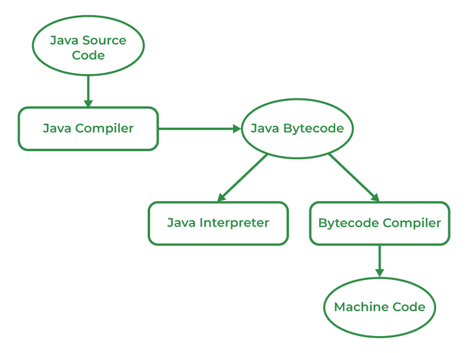

## 1. Write the simple steps to create a simple android app in eclipes ide ?

To create a simple Android app using Eclipse IDE, follow these steps:

1. Install Eclipse IDE: Download and install Eclipse IDE for Java Developers from the official Eclipse website **(https://www.eclipse.org/downloads/)**. Choose the appropriate version for your operating system.

2. Install Android Development Tools (ADT) Plugin: Launch Eclipse IDE and go to "Help" -> "Eclipse Marketplace." Search for "Android Development Tools" and click "Go." Install the ADT plugin by clicking "Install" and following the instructions.

3. Set up Android SDK: Download and install the Android SDK (Software Development Kit) from the official Android Developer website **(https://developer.android.com/studio)**. Extract the SDK to a preferred location on your computer.

4. Configure Eclipse with Android SDK: In Eclipse, go to "Window" -> "Preferences." Select "Android" from the left-hand menu. Click "Browse" next to the "SDK Location" field and navigate to the location where you installed the Android SDK. Click "Apply" and "OK."

5. Create a New Android Project: Go to "File" -> "New" -> "Project" in Eclipse. Select "Android" folder, then choose "Android Project" and click "Next." Provide a project name, package name, and other details. Select the target SDK version and minimum SDK version based on your requirements. Click "Finish."

6. Design the User Interface (UI): Eclipse will create a default layout file for you. Open the layout file (usually named "activity_main.xml") located in the "res" folder. Use the drag-and-drop editor or XML code to design the UI of your app.

7. Implement App Logic: Open the main Java file (usually named "MainActivity.java") located in the "src" folder. This is where you'll write the code for your app's functionality. Implement event handlers, data processing, and any other required logic.

8. Build and Run the App: Connect an Android device to your computer or set up an Android Virtual Device (AVD) through the Android Virtual Device (AVD) Manager in Eclipse. Ensure the device is recognized by Eclipse. Then, click on the "Run" button in Eclipse's toolbar or go to "Run" -> "Run" to build and deploy the app to the connected device or emulator.

**_(Optional Points)_**

9. Test and Debug: Once the app is deployed, test it on the device or emulator. Use the debugging features provided by Eclipse to identify and fix any issues in your code.

10. Export the App: If you're satisfied with the app, you can export it as an APK (Android Package) file for distribution. Go to "File" -> "Export" -> "Android" -> "Export Android Application." Follow the instructions and provide the necessary details to generate the APK file.

These are the basic steps to create a simple Android app using Eclipse IDE. Remember to explore Android development resources and documentation to learn more about advanced app development techniques and features.

## 2. Explain JVM ? why java is platform independent explain with diagram?

The meaning of Java platform-independent is that the Java compiled code(byte code) can run on all operating systems. A program is written in a language that is a human-readable language. It may contain words, phrases, etc which the machine does not understand. For the source code to be understood by the machine, it needs to be in a language understood by machines, typically a machine-level language. So, here comes the role of a compiler. The compiler converts the high-level language (human language) into a format understood by the machines.

Therefore, a compiler is a program that translates the source code for another program from a programming language into executable code. This executable code may be a sequence of machine instructions that can be executed by the CPU directly, or it may be an intermediate representation that is interpreted by a virtual machine. This intermediate representation in Java is the Java Byte Code.

JVM stands for Java Virtual Machine. It is a crucial component of the Java platform and is responsible for executing Java bytecode. The JVM acts as an intermediary between the Java source code and the underlying hardware or operating system.

**Step-by-Step Execution of Java Program**

1. Whenever a program is written in JAVA, the javac compiles it.
2. The result of the JAVA compiler is the .class file or the bytecode and not the machine’s native code (unlike the C compiler).
3. The bytecode generated is a non-executable code and needs an interpreter to execute on a machine. This interpreter is the JVM and thus the Bytecode is executed by the JVM.
4. And finally, the program runs to give the desired output. as shown in the figure below.



In the case of C or C++ (languages that are not platform independent), the compiler generates a .exe file which is OS dependent. When we try to run this .exe file on another OS it does not run, since it is OS-dependent and hence is not compatible with the other OS.

## 3. Explain JDK, JRE, JVM ? why java is platform independent explain with diagram?

**JDK (Java Development Kit):**
The JDK is a software development kit provided by Oracle Corporation that includes everything needed to develop, compile, and run Java applications. It consists of the Java Compiler (javac), Java Runtime Environment (JRE), and other development tools such as debuggers and documentation. The JDK is primarily used by developers to create Java applications.

**JRE (Java Runtime Environment):**
The JRE is an implementation of the Java Virtual Machine (JVM) and provides the necessary runtime environment for executing Java applications. It includes the JVM, core libraries, and other components required to run Java programs. The JRE is used by end-users who want to run Java applications on their machines but don't need to develop them.

**JVM (Java Virtual Machine):**
The JVM is a crucial component of the Java platform. It is an abstract virtual machine that provides an execution environment for Java bytecode. When you compile a Java source code file, it is converted into a platform-independent bytecode format. The JVM interprets this bytecode and executes it on the host operating system. It provides features like memory management, garbage collection, and security.

_Compilation:_
When you write a Java program, you use the JDK's Java compiler (javac) to compile the source code into bytecode. This bytecode is not specific to any particular hardware or operating system. It is a low-level representation of the program that can be understood by the JVM.

_Interpretation:_
The bytecode is then executed by the JVM, which is specific to each platform. The JVM interprets the bytecode and translates it into machine code that can be executed by the host operating system. This interpretation happens dynamically at runtime, allowing Java programs to run on any platform with a compatible JVM.

for example:

```
Java Source Code --> Compilation with JDK (javac) --> Bytecode
                                                        |
                                                        V
                                           Java Virtual Machine (JVM)
                                                        |
                                                        V
                                             Host Operating System
```

The JVM acts as an abstraction layer between the Java program and the underlying operating system. It shields the program from the hardware and operating system details, making Java platform-independent. As long as a JVM implementation exists for a particular platform, Java programs can run on that platform without any modifications.

By following this approach, Java enables "write once, run anywhere" (WORA) capability, allowing developers to create Java applications that can be deployed on diverse systems without the need for platform-specific modifications.

Note: While Java itself is platform-independent, certain Java libraries or APIs may have platform-specific implementations. In such cases, developers need to ensure that the libraries they use are compatible with the target platforms.

## 4. What is Dalvic Virtual Machine ? Differentiate between JIT and AOT?

The Dalvik Virtual Machine (DVM) was a key component of the Android operating system prior to Android 5.0 (Lollipop). It was specifically designed and optimized for running applications on mobile devices with limited resources. The DVM executed bytecode, which is a compiled form of Android application code.

**Dalvik Virtual Machine (DVM):**
The DVM was developed by Google for the Android platform. It was designed to execute bytecode, which is the compiled form of Android application code. DVM used a register-based architecture, meaning it operated on a set of virtual registers instead of a stack-based architecture like the Java Virtual Machine (JVM). It provided features like process isolation, memory management, and garbage collection to ensure efficient execution on resource-constrained mobile devices.

Since Android 5.0 (Lollipop), the Dalvik Virtual Machine has been replaced by the Android Runtime (ART), which introduced significant improvements, including the transition from JIT to AOT compilation. ART uses AOT compilation to convert the application bytecode into native machine code during the installation process, resulting in improved performance and reduced execution overhead.

The difference between JIT and AOT compilation are as follows:

| Category                | Just-in-Time (JIT) Compilation                           | Ahead-of-Time (AOT) Compilation |
| ----------------------- | -------------------------------------------------------- | ------------------------------- |
| Definition              | Compilation at runtime                                   | Compilation before execution    |
| Execution               | Interprets and compiles                                  | Directly executes native code   |
| Compilation Time        | During execution                                         | Before execution                |
| Optimization            | Optimizes frequently used code                           | Optimizes entire codebase       |
| Performance             | Improved phone restart and application installation time | Improved application start time |
| Resource Consumption    | Low resource consumption                                 | Higher resource consumption     |
| Storage Requirements    | Lower                                                    | Higher                          |
| Platform Implementation | Available on various platforms                           | Available on various platforms  |

## 5. What is the difference between Android Runtime (ART) and Dalvik Virtual Machine (DVM) ?

The difference between Android Runtime (ART) and Dalvik Virtual Machine (DVM) is as follows:
| | Dalvik | Android Runtime (ART) |
|------------------|---------------------------------|---------------------------------------|
| Execution Model | Just-In-Time (JIT) compilation | Ahead-Of-Time (AOT) compilation |
| Performance | Some overhead during initial execution, but good performance once code is compiled | Improved startup times and overall performance due to pre-compiled native machine code |
| Memory Usage | Additional memory required for storing JIT-compiled machine code | Reduced runtime memory footprint as machine code is generated during installation |
| Garbage Collection | Concurrent mark and sweep collector, occasional pauses during collection | Concurrent Copying Garbage Collector (CCGC) reduces pause times during collection |

## 6. Define mobile operating System. explain architecture and structure of android operating system with diagram.

**Mobile Operating System:**
A mobile operating system (OS) is a software platform specifically designed to run on mobile devices such as smartphones, tablets, and smartwatches. It provides a framework for managing hardware and software resources, enabling communication between applications and the underlying device components. Mobile operating systems handle tasks such as managing memory, running applications, providing user interfaces, and facilitating connectivity.

**_Android Operating System Architecture:_**

The architecture of the Android operating system is based on a layered approach, with each layer providing different functionalities. Here is a high-level overview of the Android OS architecture:

1. **Linux Kernel:** The foundation of the Android OS is the Linux kernel, which handles essential low-level functionalities such as device drivers, memory management, security, and process management. The Linux kernel provides a hardware abstraction layer to interact with the device's hardware components.

2. **Hardware Abstraction Layer (HAL):** This layer provides a standardized interface for Android to interact with various hardware components, including camera, display, sensors, Bluetooth, Wi-Fi, and more. The HAL acts as a bridge between the higher-level Android framework and the underlying device hardware.

3. **Android Runtime (ART):** The ART layer is responsible for executing and managing Android applications. It includes the virtual machine that runs the application code and performs ahead-of-time (AOT) compilation, converting bytecode into native machine code for improved performance. ART also manages memory, garbage collection, and runtime environments for applications.

4. **Native C/C++ Libraries:** Android includes a set of native libraries written in C/C++ that provide core functionalities, such as graphics rendering (OpenGL), media playback, database management (SQLite), and more. These libraries are accessible to developers through the Android application framework.

5. **Java API Framework:** The Java API framework forms the core of Android's application development environment. It provides a rich set of classes and APIs that developers use to build Android applications. The framework includes components such as Activity Manager, Content Providers, Location Manager, Telephony Manager, and others. These components enable developers to access device features and services while ensuring consistent behavior across different Android devices.

6. **System Applications:** The Android OS comes with several pre-installed system applications that offer core functionalities, including phone, contacts, messaging, browser, camera, calendar, and more. These applications serve as reference implementations and can be replaced or enhanced by device manufacturers or third-party applications.

**_Android Operating System Structure:_**

```
+-----------------------------------------+
|              Applications               |
+-----------------------------------------+
|     Android Framework (Java API)        |
+-----------------------------------------+
|          Android Runtime (ART)          |
+-----------------------------------------+
|    Native C/C++ Libraries and HAL       |
+-----------------------------------------+
|             Linux Kernel                |
+-----------------------------------------+
```


_Diagram illustrating the structure of the Android operating system:_

**(optional)**

**_Android File System Stucture:_**
File System Structure:

1. _/system:_ Contains core system files and libraries.
2. _/data:_ Holds user data, such as app data, user settings, and downloaded files.
3. _/system/app:_ Contains pre-installed system applications.
4. _/system/framework:_ Includes the Android framework files.
5. _/system/bin_ and _/system/xbin:_ Store system binaries and executables.
6. _/system/lib:_ Holds shared libraries used by system components and apps.
7. _/data/data:_ Contains the data and settings of installed applications.

## 7. Difference among hybrid native and html5 application development.

| Aspect                    | Hybrid Application Development                                                                                                                                  | Native Application Development                                                                                                 | HTML5 Application Development                                                                                                                        |
| ------------------------- | --------------------------------------------------------------------------------------------------------------------------------------------------------------- | ------------------------------------------------------------------------------------------------------------------------------ | ---------------------------------------------------------------------------------------------------------------------------------------------------- |
| Definition                | Hybrid application development combines elements of both native and web development to create apps that can run on multiple platforms.                          | Native application development involves creating apps specifically for a particular platform or operating system.              | HTML5 application development uses web technologies like HTML5, CSS, and JavaScript to build apps that can run on different devices and platforms.   |
| Development Approach      | Uses web technologies (HTML, CSS, JavaScript) wrapped in a native shell or framework (e.g., Cordova, Ionic) to create cross-platform apps.                      | Develops apps natively using platform-specific languages and tools (e.g., Java/Kotlin for Android, Swift/Objective-C for iOS). | Utilizes web technologies (HTML5, CSS, JavaScript) to build apps that are accessed through a web browser.                                            |
| User Interface            | Typically uses web-based UI frameworks (e.g., React Native, Angular) that provide native-like UI components and interactions across platforms.                  | Employs platform-specific UI components and design patterns to create a seamless and native user experience.                   | Relies on web-based UI frameworks and libraries to create user interfaces that work across different devices and platforms.                          |
| Performance               | Generally has slightly lower performance compared to native apps due to the additional layer between the web technologies and the device's native capabilities. | Offers high performance as it directly utilizes the platform's native capabilities and APIs.                                   | Performance is generally lower than native apps but can vary depending on the complexity of the app and the browser's capabilities.                  |
| Access to Device Features | Can access certain device features and APIs through plugins or wrappers but may have limitations compared to native apps.                                       | Provides full access to all device features and native APIs, allowing for deeper integration with the device's functionality.  | Has limited access to device features and APIs and relies on browser capabilities and permissions.                                                   |
| App Store Distribution    | Can be distributed through app stores (e.g., Google Play Store, Apple App Store) or as web apps accessible through URLs.                                        | Requires separate development and distribution for each platform's app store (e.g., Google Play Store, Apple App Store).       | Distributed as web apps accessible through URLs or can be packaged using tools like PhoneGap/Cordova for app store distribution.                     |
| Development Cost and Time | Generally requires less development time and cost compared to native app development due to code reuse across platforms.                                        | Requires separate development efforts for each platform, resulting in higher development time and cost.                        | Usually has shorter development time and lower cost compared to native apps, primarily due to code reuse and fewer platform-specific considerations. |
| Offline Capability        | Can offer limited offline capabilities by caching web content or using local storage, but offline functionality may be limited compared to native apps.         | Can provide robust offline capabilities by leveraging local data storage and caching mechanisms.                               | Limited offline capability as it heavily relies on an internet connection, although offline caching and local storage options are available.         |

## 8. Explain hybrid native and html5 application development with pros and cons.

**_Hybrid Application Development:_**
Hybrid application development combines elements of both native and web development to create apps that can run on multiple platforms.

**_`Pros:`_**

1. Cross-platform compatibility: Hybrid apps can run on multiple platforms, such as Android, iOS, and Windows, reducing the need for separate codebases.
2. Faster development: Hybrid frameworks often provide pre-built UI components and simplified development processes, enabling faster app development.
3. Access to device features: Hybrid frameworks offer access to device features and native APIs through plugins or wrappers, allowing for integration with the device's functionality.
4. Simplified maintenance: Updates and bug fixes can be implemented across multiple platforms simultaneously, making maintenance easier.
5. Code reuse: Hybrid apps allow for code reuse across different platforms, resulting in reduced development time and cost.

**_`Cons:`_**

1. Performance limitations: Hybrid apps may have slightly lower performance compared to native apps due to the additional layer between the web technologies and the device's native capabilities.
2. Limited access to device features: Although hybrid apps can access certain device features, they may have limitations compared to native apps, as they rely on plugins or wrappers.
3. UI limitations: Achieving a fully native and seamless user interface experience can be challenging in hybrid apps, as they use web-based UI frameworks.
4. App store restrictions: Hybrid apps distributed through app stores may face certain limitations or restrictions imposed by the app store guidelines.
5. Dependency on hybrid frameworks: Hybrid app development relies on the availability and compatibility of hybrid frameworks, which can introduce some level of dependency and potential limitations.

**_Native Application Development:_**
Native application development involves creating apps specifically for a particular platform or operating system.
**_`Pros:`_**

1. Superior performance: Native apps leverage the platform's native capabilities and APIs, resulting in high performance and responsiveness.
2. Full access to device features: Native apps have complete access to all device features and native APIs, allowing for seamless integration and utilization of the device's functionality.
3. Enhanced user experience: Native apps can provide a highly tailored and optimized user experience, as they utilize platform-specific UI components and design patterns.
4. App store optimization: Native apps can take advantage of app store optimization techniques to improve discoverability and visibility in app stores.
5. Greater offline capabilities: Native apps can provide robust offline capabilities by leveraging local data storage and caching mechanisms.

**_`Cons:`_**

1. Development cost and time: Native app development requires separate development efforts for each platform, resulting in higher development time and cost compared to hybrid or HTML5 apps.
2. Platform dependencies: Developing native apps requires knowledge of platform-specific languages and tools, which may limit the developer's ability to create apps for multiple platforms.
3. Maintenance challenges: Updates and bug fixes need to be implemented separately for each platform, potentially increasing the maintenance workload.
4. App store approval process: Native apps must go through the app store approval process, which can introduce delays and additional requirements.
5. Fragmented user base: Developing for multiple platforms means addressing a fragmented user base and potentially managing different versions of the app simultaneously.

**_HTML5 Application Development:_**
HTML5 application development uses web technologies like HTML5, CSS, and JavaScript to build apps that can run on different devices and platform
**_`Pros:`_**

1. Cross-platform compatibility: HTML5 apps can run on various devices and platforms, including smartphones, tablets, and desktops.
2. Development simplicity: HTML5 development is relatively easy and straightforward, as it utilizes familiar web technologies and frameworks.
3. Lower development cost and time: HTML5 apps can be developed faster and at a lower cost compared to native apps due to code reuse and fewer platform-specific considerations.
4. Easier maintenance: Updates and bug fixes can be implemented universally since HTML5 apps are accessed through a web browser.
5. Greater accessibility: HTML5 apps can be accessed through a web browser, making them more accessible and discoverable.

**_`Cons:`_**

1. Performance limitations: HTML5 apps generally have lower performance compared to native apps, although this can vary depending on the complexity of the app and the browser's capabilities.
2. Limited access to device features: HTML5 apps have limited access to device features and APIs, as they rely on browser capabilities and permissions.
3. UI limitations: Achieving a fully native and seamless user interface experience can be challenging in HTML5 apps, as they use web-based UI frameworks.
4. Offline capability: HTML5 apps heavily rely on an internet connection, although offline caching and local storage options are available.
5. App store restrictions: HTML5 apps distributed through app stores may face certain limitations or restrictions imposed by the app store guidelines.
