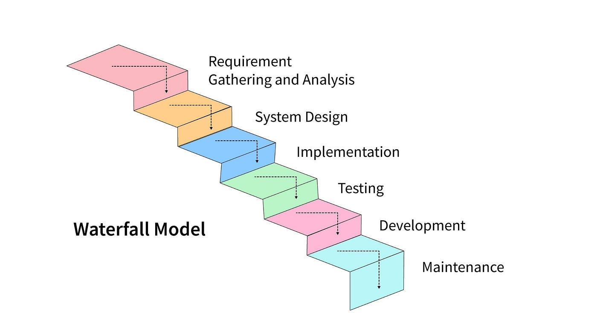
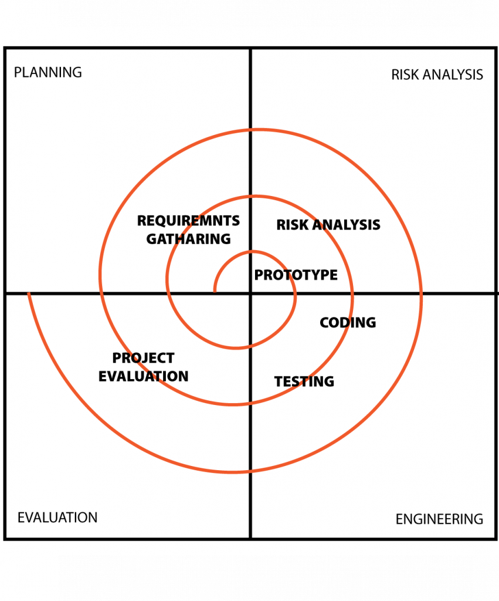
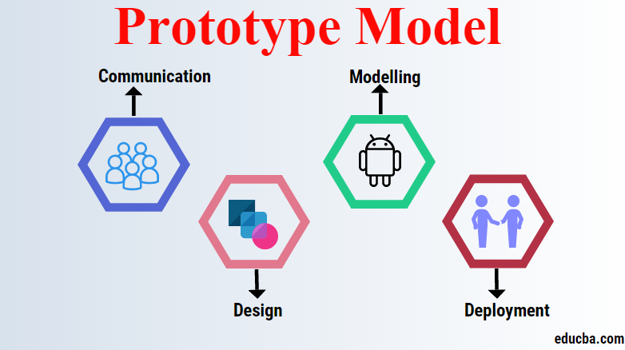
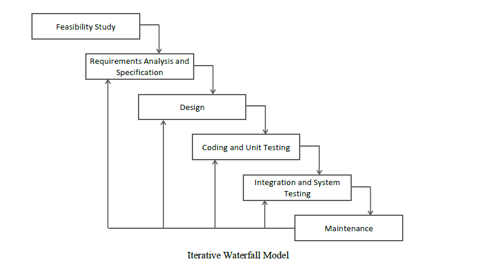
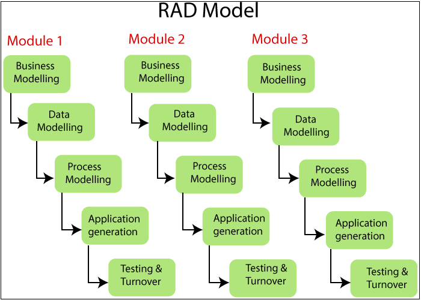
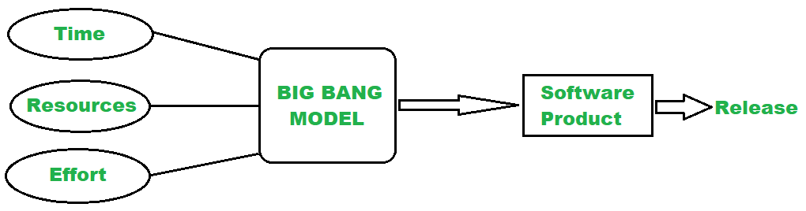

# Unit 3 - Programming Techniques:

## Introduction to Programming Techniques:

Programming is the process of designing and building an executable computer program to accomplish a specific task. Programming techniques refer to the various approaches and methodologies used by programmers to write efficient, readable, and maintainable code. These techniques are essential for solving problems and creating software applications. Here are some fundamental programming techniques:

1. **Algorithm Design:**

   - Algorithms are step-by-step procedures or formulas for solving problems. Effective algorithm design is crucial for creating efficient programs. It involves breaking down a problem into smaller, manageable steps and defining the logic for each step.

2. **Problem Solving:**

   - Programming is essentially about problem-solving. Programmers need to analyze a problem, understand its requirements, and devise a plan to solve it through coding. This involves critical thinking and the ability to break down complex issues into simpler components.

3. **Data Structures:**

   - Data structures are the building blocks of any program, defining how data is organized and manipulated. Understanding and choosing appropriate data structures, such as arrays, linked lists, stacks, and queues, can significantly impact the efficiency and performance of a program.

4. **Programming Paradigms:**

   - Different programming paradigms, such as procedural, object-oriented, and functional programming, provide different ways to organize code. Each paradigm has its strengths and weaknesses, and programmers often choose the one that best fits the problem at hand.

5. **Code Modularity:**

   - Breaking code into smaller, independent modules makes it easier to understand, test, and maintain. This approach, known as modular programming, promotes code reusability and helps manage complexity.

6. **Debugging and Testing:**

   - Debugging is the process of identifying and fixing errors or bugs in the code. Testing involves verifying that the program behaves as expected. Learning effective debugging and testing techniques is essential for producing reliable and robust software.

7. **Documentation:**

   - Writing clear and concise documentation is a crucial programming technique. Good documentation helps other programmers understand the code, use functions or modules correctly, and troubleshoot issues.

8. **Version Control:**

   - Version control systems like Git help manage changes to the source code over time. They allow collaboration among multiple developers, track revisions, and provide a safety net in case something goes wrong.

9. **Optimization:**

   - Optimization involves improving the performance of a program by making it run faster, use fewer resources, or produce smaller output. This includes optimizing algorithms, data structures, and code efficiency.

10. **Security Considerations:**
    - Understanding and implementing security measures is vital, especially in applications that handle sensitive data. This involves validating input, preventing common vulnerabilities, and adopting secure coding practices.

## Types of Programming Techniques (Approaches)

1. **Procedural Programming:**

   - Organizing code as a sequence of procedures or functions that operate on data. It focuses on the step-by-step execution of a program.

2. **Object-Oriented Programming (OOP):**

   - Structuring code around objects, which encapsulate data and behavior. Key concepts include classes, inheritance, polymorphism, and encapsulation.

3. **Functional Programming:**

   - Treating computation as the evaluation of mathematical functions. Emphasizes immutability, pure functions, and the avoidance of side effects.

4. **Declarative Programming:**

   - Describing what a program should accomplish without specifying how to achieve it. SQL and HTML are examples of declarative languages.

5. **Event-Driven Programming:**

   - Responding to events or user interactions by triggering appropriate actions. Common in graphical user interfaces and web development.

6. **Aspect-Oriented Programming (AOP):**

   - Separating cross-cutting concerns (e.g., logging, security) from the main business logic, improving modularity.

7. **Logic Programming:**

   - Defining a set of logical rules and relationships to solve problems. Prolog is a notable example.

8. **Imperative Programming:**

   - Describing computation in terms of statements that change a program's state. Common in low-level languages like C.

9. **Dynamic Programming:**

   - Solving complex problems by breaking them down into simpler overlapping subproblems. Commonly used in optimization problems.

10. **Parallel Programming:**

    - Executing multiple tasks simultaneously, often to improve performance by utilizing multiple processors or cores.

11. **Meta-Programming:**

    - Writing programs that generate or manipulate other programs. Common in template metaprogramming and code generation.

12. **Model-Driven Engineering (MDE):**

    - Building software models at a high level of abstraction and automatically generating code from these models.

13. **Test-Driven Development (TDD):**

    - Writing tests before writing the actual code. Ensures that the code meets the specified requirements and helps with code design.

14. **Behavior-Driven Development (BDD):**

    - Extending TDD by writing tests in natural language that describe the expected behavior of the system.

15. **Agile Programming:**

    - Emphasizing iterative development, collaboration, and customer feedback. Agile methodologies include Scrum and Kanban.

16. **Extreme Programming (XP):**

    - An agile methodology focusing on frequent releases, continuous feedback, and collaborative development practices.

17. **Rapid Application Development (RAD):**

    - Emphasizing quick development and iteration. RAD involves minimal planning and emphasizes user feedback.

18. **Low-Code and No-Code Development:**

    - Using visual interfaces and pre-built components to create applications with minimal hand-coding.

19. **Microservices Architecture:**

    - Designing software as a collection of small, independent services that communicate through well-defined APIs.

20. **Service-Oriented Architecture (SOA):**
    - Building software as a set of loosely coupled, interoperable services that communicate over a network.

## Modular Approach to Programming:

A modular approach, also known as modular programming, is a programming paradigm that involves breaking down a software system into smaller, independent, and interchangeable modules or components. Each module represents a distinct functionality or feature of the system and is designed to operate independently while interacting with other modules through well-defined interfaces. The goal of a modular approach is to enhance code organization, reusability, maintainability, and collaboration among developers.
Here are key aspects of a modular approach:

1. \***\*Module Definition:**

   - A module is a self-contained unit of code that performs a specific set of functions. It encapsulates related variables, functions, or classes, providing a clean and well-defined interface for interaction with the rest of the system.

2. \***\*Encapsulation:**

   - Modules encapsulate their internal details, exposing only a well-defined interface to the outside world. This encapsulation helps in hiding the complexity of the module's implementation, promoting a clearer understanding of the overall system.

3. \***\*Reusability:**

   - Modular design promotes the reuse of code. Once a module is developed and tested, it can be easily reused in different parts of the application or even in other projects, reducing redundancy and development time.

4. \***\*Maintainability:**

   - Changes to a system are easier to manage when using a modular approach. Since modules are independent, modifying or updating one module does not necessarily impact others, making it easier to locate and fix bugs or add new features.

5. \***\*Scalability:**

   - As the system grows, additional functionality can be implemented by adding new modules. This scalability allows for the expansion of the software without major disruptions to existing modules.

6. \***\*Interchangeability:**

   - Modules with similar functionality should be interchangeable, meaning that they can be replaced with minimal impact on the rest of the system. This makes it easier to adapt and evolve the software over time.

7. \***\*Interfaces:**

   - Well-defined interfaces specify how modules interact with each other. This involves declaring functions, classes, or communication protocols that modules adhere to, facilitating communication and integration.

8. \***\*Collaboration:**

   - Different developers or teams can work on separate modules simultaneously without interfering with each other, promoting parallel development and collaboration.

9. \***\*Testing:**

   - Modules can be tested independently, allowing for more focused and efficient testing efforts. This isolation makes it easier to identify and fix issues within specific modules.

10. \***\*Debugging:**

    - Debugging becomes more straightforward as issues are localized to specific modules. This reduces the complexity of identifying and fixing problems in the overall system.

11. \***\*Documentation:**
    - Each module should come with clear documentation that outlines its purpose, functionality, and usage. This documentation aids developers in understanding how to use the module correctly.

### Advantages and disadvantages of using Modular Approach

**Advantages of Using Modular Approach:**

1. **Reusability:** Modules can be reused in different parts of the application or even in other projects, reducing redundancy and saving development time.

2. **Maintainability:** Changes and updates are easier to manage because modules are independent. Modifications to one module do not necessarily affect others, making it easier to locate and fix issues.

3. **Scalability:** Additional functionality can be added by introducing new modules, allowing the software to grow and adapt to changing requirements.

4. **Collaboration:** Different developers or teams can work on separate modules simultaneously without interfering with each other, promoting parallel development and collaboration.

5. **Testing Ease:** Modules can be tested independently, facilitating more focused and efficient testing efforts. This isolation makes it easier to identify and fix issues within specific modules.

6. **Debugging:** Debugging is simplified as issues are localized to specific modules. This reduces the complexity of identifying and fixing problems in the overall system.

7. **Documentation:** Each module comes with clear documentation, aiding developers in understanding its purpose, functionality, and usage.

8. **Encapsulation:** Modules encapsulate their internal details, hiding complexity and providing a well-defined interface for interaction with the rest of the system.

9. **Interchangeability:** Modules with similar functionality can be interchangeable, meaning they can be replaced with minimal impact on the rest of the system.

10. **Adaptability:** The modular approach allows for the adaptation and evolution of software over time, accommodating changing requirements without disrupting the entire system.

**Disadvantages of Using Modular Approach:**

1. **Overhead:** The design and implementation of well-defined interfaces and modular structures can introduce some initial overhead in terms of planning and development time.

2. **Complexity:** In some cases, breaking down a system into too many small modules can lead to increased complexity, especially if the relationships between modules become intricate.

3. **Communication Overhead:** Coordination between modules may require careful planning and communication, especially in larger projects with numerous developers working on different modules.

4. **Learning Curve:** Developers new to the project may need time to understand the modular structure and the interactions between different modules.

5. **Inconsistency:** If not managed properly, differences in coding styles, documentation, or module interfaces can lead to inconsistencies across modules.

6. **Dependency Management:** Managing dependencies between modules can be challenging. Changes in one module may affect others, requiring careful coordination.

7. **Performance Overhead:** There can be a slight performance overhead due to the need to manage interfaces and interactions between modules.

8. **Initial Design Challenges:** Properly designing a modular system requires careful consideration of the relationships between modules, which can be challenging during the initial design phase.

## Top-down Approach

The top-down approach is a design and problem-solving methodology that involves breaking down a complex system into smaller, more manageable subsystems or modules. In this approach, the solution to a problem is developed by first understanding the big picture and then gradually breaking it down into smaller details.
The top-down approach is commonly used in software engineering, system analysis, and other problem-solving domains. While it has several advantages, such as providing a clear structure and facilitating incremental development, it may face challenges if the initial high-level design is not accurate or if there are difficulties in determining the appropriate decomposition of the problem. Successful application of the top-down approach requires careful planning and a thorough understanding of the problem domain.

The top-down approach is commonly associated with the following principles and characteristics:

1. **Problem Decomposition:**

   - The primary concept of the top-down approach is to decompose a complex problem into smaller, more manageable sub-problems. Each sub-problem is then further broken down until the problems become simple enough to be easily solved.

2. **Hierarchical Structure:**

   - The design and structure of the system follow a hierarchical pattern. The main problem is at the top level, and it is decomposed into sub-problems, creating a tree-like structure with a top-down flow of information.

3. **Stepwise Refinement:**

   - The solution is refined step by step, starting from a high-level overview and progressing to more detailed levels. At each step, the focus is on refining and detailing one specific aspect of the solution.

4. **Top-Down Design:**

   - The design of the system begins with a high-level, abstract view, specifying major components and their interactions. Subsequently, each major component is refined into smaller components until the design is detailed enough for implementation.

5. **Divide and Conquer:**

   - The top-down approach employs a "divide and conquer" strategy. Breaking down a problem into smaller components makes it easier to understand, solve, and implement each part independently.

6. **Functional Decomposition:**

   - The system is decomposed based on its functions or functionalities. Each function is treated as a separate module, and the interactions between these modules are carefully defined.

7. **Progressive Detailing:**

   - As the design progresses from higher to lower levels, each level provides more detailed information about the system. This detailing includes refining algorithms, specifying data structures, and outlining control flow.

8. **Early Identification of Major Components:**

   - The top-down approach allows for the early identification of major components and their relationships, providing a clear understanding of the overall system architecture.

9. **Ease of Maintenance:**

   - The hierarchical and modular structure makes the system more maintainable. Changes or updates can be applied to specific modules without affecting the entire system, contributing to ease of maintenance.

10. **Incremental Development:**
    - The top-down approach often supports incremental development. The system can be implemented and tested in stages, with each stage adding new functionality or refining existing features.

### Advantages and disadvantages of Top-Down Approach

**Advantages of Top-Down Approach:**

1. **Clarity of Design:**

   - The top-down approach provides a clear and systematic design structure, starting with a high-level overview and progressively breaking it down into detailed components. This clarity makes it easier for developers to understand and implement the system.

2. **Hierarchical Organization:**

   - The hierarchical organization of the top-down approach simplifies the complexity of large systems by breaking them into smaller, more manageable subsystems. Each subsystem can be designed and implemented independently.

3. **Early Identification of Major Components:**

   - Major components and their relationships are identified early in the design process, allowing for a better understanding of the overall system architecture.

4. **Ease of Maintenance:**

   - The modular and hierarchical structure facilitates ease of maintenance. Changes or updates can be made to specific modules without affecting the entire system, making maintenance more straightforward.

5. **Incremental Development:**

   - The top-down approach supports incremental development, enabling the implementation and testing of the system in stages. Each stage adds new functionality or refines existing features.

6. **Modularity and Reusability:**

   - The approach promotes modularity, allowing for the development of reusable modules. These modules can be used in other parts of the system or in different projects, leading to increased efficiency in development.

7. **Efficient Resource Utilization:**

   - Resources can be allocated more efficiently since each module is developed independently, and teams can work on different modules simultaneously.

8. **Progressive Detailing:**
   - The design progresses from higher to lower levels, providing more detailed information about the system at each stage. This progressive detailing aids in a thorough understanding of the system's intricacies.

**Disadvantages of Top-Down Approach:**

1. **Limited Detail at the Beginning:**

   - The top-down approach may provide limited details at the initial stages of design, and this can be a challenge when trying to implement specific functionalities without a detailed plan.

2. **Difficulty in Handling Uncertainty:**

   - If the problem domain is not well-understood or if there is uncertainty in the requirements, the top-down approach may face challenges in providing an accurate high-level design.

3. **Inflexibility to Changes:**

   - Changes in the high-level design can be challenging to accommodate, especially if they impact multiple lower-level modules. This inflexibility can result in the need for substantial redesign.

4. **Potential for Inefficient Subsystems:**

   - There is a risk that the top-down approach may lead to subsystems that are not as efficient or optimized as they could be since the focus is on breaking down the problem rather than optimizing each module individually.

5. **Dependency on Initial High-Level Design:**

   - The success of the top-down approach heavily relies on the accuracy of the initial high-level design. If the initial design is flawed, it can lead to problems down the development process.

6. **Limited Involvement of Lower-Level Developers:**

   - Lower-level developers might have limited involvement in the initial stages of design, potentially leading to misunderstandings or overlooking important details.

7. **Complexity Management:**
   - Managing the complexity of large systems can be challenging, especially if the decomposition of the problem is not well-executed or if the interactions between subsystems become intricate.

## Bottom UP Approach

The bottom-up approach is a design and problem-solving methodology that involves starting with the implementation of individual components or modules and gradually combining them to form a complete system. In contrast to the top-down approach, which begins with a high-level overview and breaks it down into smaller components, the bottom-up approach emphasizes building from the ground up.
In practice, the choice between a top-down and a bottom-up approach often depends on the nature of the project, the clarity of requirements, and the preferences of the development team. Hybrid approaches that combine elements of both top-down and bottom-up methodologies are also commonly used to take advantage of their respective strengths.

**Key Characteristics:**

1. **Component Implementation:**

   - The bottom-up approach starts by implementing individual components or modules that perform specific functions. These components are designed and tested independently.

2. **Incremental Integration:**

   - Once individual components are developed and tested, they are incrementally integrated to form larger subsystems. This process continues until the entire system is built.

3. **Progressive Complexity:**

   - Complexity increases progressively as components are combined into larger subsystems and, eventually, into the complete system.

4. **Early Identification of Issues:**

   - Issues related to individual components or small subsystems are identified and addressed early in the development process, reducing the likelihood of major problems later on.

5. **Flexible and Adaptive:**

   - The bottom-up approach is often more flexible and adaptive to changes, as modifications to individual components can be accommodated without affecting the entire system.

6. **Parallel Development:**

   - Different teams or developers can work concurrently on various components, allowing for parallel development and potentially faster progress.

7. **Testability:**
   - Individual components can be thoroughly tested before integration, making it easier to identify and fix issues at the component level.

**Advantages of Bottom-Up Approach:**

1. **Early Identification of Issues:**

   - Issues related to individual components are identified early in the development process, making it easier to address and fix problems at a smaller scale.

2. **Incremental Development:**

   - Incremental integration allows for the progressive development and testing of the system, providing tangible results at each stage.

3. **Flexibility to Changes:**

   - The bottom-up approach is often more flexible and adaptable to changes, as modifications to individual components can be accommodated without affecting the entire system.

4. **Parallel Development:**

   - Different teams or developers can work concurrently on various components, allowing for parallel development and potentially faster progress.

5. **Testability:**
   - Individual components can be thoroughly tested before integration, making it easier to identify and fix issues at the component level.

**Disadvantages of Bottom-Up Approach:**

1. **Delayed System Integration:**

   - Integration of components into a complete system may be delayed until later stages of development, potentially deferring the demonstration of system-level functionality.

2. **Dependency Management:**

   - Managing dependencies between components and ensuring they interact correctly during integration can be challenging.

3. **Lack of Early System Overview:**

   - The bottom-up approach may not provide a comprehensive high-level overview of the system early in the development process, making it harder to assess the overall system architecture.

4. **Complexity Management:**

   - Managing the complexity of the system, especially as more components are integrated, can be challenging and may require careful coordination.

5. **Possibility of Component Redundancy:**

   - Without a clear high-level design, there is a risk of developing redundant or unnecessary components that may not contribute effectively to the overall system.

6. **Potentially Higher Testing Costs:**
   - The need for thorough testing at the component level and during integration may result in higher testing costs compared to a top-down approach.

## Difference between Top-Down and Bottom-Up Approach

The top-down and bottom-up approaches are two different strategies for designing and implementing software systems. The top-down approach begins with a high-level overview and breaks it down into smaller components, while the bottom-up approach starts with the implementation of individual components and gradually combines them to form a complete system. Here are some key differences between the two approaches:

| Aspect                   | Top-Down Approach                                                                                                 | Bottom-Up Approach                                                                                                                 |
| ------------------------ | ----------------------------------------------------------------------------------------------------------------- | ---------------------------------------------------------------------------------------------------------------------------------- |
| Definition               | Begins with a high-level overview and decomposes into smaller components.                                         | Starts with the implementation of individual components and progresses to larger systems.                                          |
| Design Process           | Design flows from the general (high-level) to the specific (low-level).                                           | Design flows from the specific (low-level) to the general (high-level).                                                            |
| Integration              | Integration occurs gradually from high to low levels.                                                             | Integration occurs incrementally from low to high levels.                                                                          |
| Identification of Issues | Early identification of high-level design issues. Issues related to components may be deferred.                   | Early identification of issues related to individual components. System-level issues may be deferred.                              |
| Flexibility to Changes   | May be less flexible to changes, especially impacting overall architecture.                                       | Generally more flexible, allowing changes to individual components without affecting the entire system.                            |
| Risk Management          | Risks related to overall architecture are identified early. Risks related to component details may surface later. | Risks related to individual components are identified early. Risks related to system integration and architecture may be deferred. |
| Testing                  | Testing occurs as integration progresses. Focus on interactions between components.                               | Components are thoroughly tested in isolation before integration. Testing at the component level is emphasized.                    |
| Parallel Development     | Parallel development is feasible with clear interfaces and communication.                                         | Encourages parallel development, allowing different teams to work on various components simultaneously.                            |
| System Overview          | Provides an early high-level overview of the system architecture.                                                 | System overview may be deferred until later stages of development.                                                                 |
| Complexity Management    | Manages complexity by breaking down large systems into smaller components.                                        | Complexity may increase progressively as more components are integrated.                                                           |

## Structured Programming Technique

Structured programming is a programming paradigm that emphasizes the use of structured control flow and modular design to create clear, efficient, and maintainable software. It was introduced to improve upon the unstructured programming practices prevalent in the early days of programming. Here are some key aspects of structured programming:

1. **Control Structures:**

   - Structured programming primarily relies on three basic control structures: sequence, selection, and iteration. These control structures help organize the flow of program execution in a clear and logical manner.

   - **Sequence:** Represents the linear order of execution of statements.
   - **Selection (Conditional Statements):** Includes if-else statements that allow the program to make decisions based on conditions.
   - **Iteration (Loops):** Involves constructs like while loops and for loops, enabling repetitive execution of code.

2. **Modular Programming:**

   - Modular programming is a key principle of structured programming. It involves breaking down a program into smaller, manageable modules or functions, each responsible for a specific task. This promotes code reuse, easy maintenance, and collaborative development.

3. **Single Entry, Single Exit (SESE):**

   - The structured programming paradigm advocates for a single entry point and a single exit point in functions and loops. This helps enhance code readability and maintainability by avoiding complex branching structures.

4. **Top-Down Design:**

   - Top-down design is a systematic approach in structured programming, where the program's design begins with a high-level overview, and the details are progressively refined. The top-down approach helps in breaking down complex problems into simpler, more manageable sub-problems.

5. **Data Encapsulation:**

   - Structured programming encourages the use of encapsulation, where data and the functions that operate on that data are grouped together in modules. This helps in creating clear interfaces and reducing the dependencies between different parts of the program.

6. **Goto Avoidance:**

   - One of the significant departures from unstructured programming is the avoidance of unrestricted use of the `goto` statement. Instead, structured programming promotes the use of structured control flow constructs.

7. **Readability and Maintainability:**

   - The focus on clear control structures, modular design, and avoidance of complex control flow contributes to enhanced readability and maintainability of the code. This is crucial for collaborative software development.

8. **Debugging and Testing:**

   - The structured approach simplifies debugging and testing by isolating logical blocks of code within modules. This allows for more straightforward identification and resolution of issues.

9. **Language Support:**
   - Many modern programming languages, such as C, Pascal, and Ada, were designed with structured programming principles in mind. These languages provide constructs like if-else statements, loops, and functions to facilitate structured programming.

## Three Basic Logical Structures

These three logical structures form the foundation for constructing more complex algorithms and programs. By combining sequences, selections, and iterations, developers can create sophisticated and efficient solutions to various problems. The structured programming paradigm emphasizes the use of these logical structures to enhance code clarity, maintainability, and understandability.
The three basic logical structures in programming are:

1. **Sequence:**

   - **Definition:** Sequence is the simplest logical structure, representing an ordered set of statements or instructions that are executed sequentially, one after the other.

   - **Example:**

     ```python
     Step 1: Initialize variable x
     Step 2: Read input from the user and assign it to x
     Step 3: Multiply x by 2
     Step 4: Display the result
     ```

   - **Key Characteristics:**
     - Execution flows in a linear fashion, following the order of the statements.
     - Each statement is executed exactly once.

2. **Selection (Conditional Statements):**

   - **Definition:** Selection introduces decision-making into the program, allowing it to execute different sets of statements based on a condition.

   - **Example (in Python):**

     ```python
     if condition:
         # statements to execute if the condition is true
     else:
         # statements to execute if the condition is false
     ```

   - **Key Characteristics:**
     - Execution depends on whether a specified condition evaluates to true or false.
     - Allows branching in the program flow.

3. **Iteration (Loops):**

   - **Definition:** Iteration enables the repetitive execution of a set of statements as long as a specific condition holds true.

   - **Example (in Python):**

     ```python
     while condition:
         # statements to execute while the condition is true
     ```

   - **Key Characteristics:**
     - Executes a block of statements repeatedly as long as the specified condition is true.
     - Prevents code duplication by allowing the same set of instructions to be executed multiple times.

## Advantages and disadvantages of using Structured Programming

**Advantages of Structured Programming:**

1. **Readability:**

   - The use of structured control flow constructs (sequence, selection, and iteration) enhances code readability, making it easier for developers to understand and maintain the code.

2. **Modularity:**

   - Structured programming promotes modular design by breaking down a program into smaller, manageable modules or functions. This modularity facilitates code reuse and simplifies maintenance.

3. **Maintainability:**

   - The modular structure and clear control flow in structured programming contribute to ease of maintenance. Updates or changes to the code can be localized to specific modules without affecting the entire program.

4. **Debugging:**

   - Identifying and fixing bugs is simplified due to the clear structure and systematic organization of the code. Logical errors are easier to isolate and correct.

5. **Efficiency:**

   - Structured programming often leads to more efficient code as it discourages the use of certain programming constructs, such as unbridled use of the `goto` statement, which can lead to spaghetti code and inefficiencies.

6. **Portability:**

   - Structured programming languages are often designed to be portable across different platforms. This portability allows code to be easily adapted to various environments without major modifications.

7. **Team Collaboration:**

   - The modular and readable nature of structured programming makes it conducive to collaborative development. Different team members can work on different modules simultaneously.

8. **Top-Down Design:**

   - The top-down design approach, which is a key aspect of structured programming, promotes a systematic way of breaking down complex problems into simpler, more manageable sub-problems.

9. **Reduction of Control Statements:**
   - Structured programming discourages the excessive use of control statements like `goto`, leading to more predictable and understandable code.

**Disadvantages of Structured Programming:**

1. **Limitations in Expressiveness:**

   - In some cases, structured programming may be seen as less expressive compared to other paradigms. Complex problems may require additional abstractions or mechanisms not easily accommodated in a purely structured approach.

2. **Limited for Some Types of Problems:**

   - For certain types of problems, such as those that involve complex state machines or intricate concurrency patterns, a purely structured programming approach might feel restrictive.

3. **Learning Curve:**

   - Developers accustomed to unstructured or less-structured programming paradigms may face a learning curve when transitioning to structured programming due to its different principles and constraints.

4. **Potential for Over-Modularization:**

   - While modularity is a strength, excessive modularization without a clear design strategy can lead to an overabundance of small, specialized modules, potentially complicating the overall system.

5. **Increased Code Length:**

   - The use of structured constructs, such as explicit loops and nested if-else statements, can sometimes lead to longer code compared to more concise paradigms, although this can be subjective.

6. **Increased Memory Usage:**

   - Depending on the implementation and language features, structured programming may lead to increased memory usage due to the overhead associated with function calls and modularization.

7. **Not Ideal for All Types of Projects:**
   - While well-suited for general-purpose programming and business applications, structured programming might not be the best fit for certain specialized domains or specific project requirements.

## Object-Oriented Programming Technique

Object-Oriented Programming (OOP) is a programming paradigm that uses objects—collections of data and methods that operate on the data—to design and organize code. It is based on several key principles that promote a modular, reusable, and extensible approach to software development.
Popular object-oriented programming languages include Java, C++, Python, C#, and Ruby. These languages provide built-in support for classes, objects, and the principles of OOP. Object-oriented design and programming offer a powerful and flexible paradigm for building complex and scalable software systems. The principles of OOP contribute to code organization, reusability, and the development of software that closely models real-world entities and their interactions.
Here are some fundamental concepts and features of Object-Oriented Programming:

1. **Classes and Objects:**

   - **Class:** A blueprint or template for creating objects. It defines a set of attributes (data members) and methods (functions) that the objects based on the class will have.
   - **Object:** An instance of a class. Objects are created from classes and represent specific instances of the data and behavior defined in the class.

2. **Encapsulation:**

   - Encapsulation involves bundling the data (attributes) and methods (functions) that operate on the data within a class. Access to the internal details of an object is controlled, and external code interacts with the object through well-defined interfaces.

3. **Inheritance:**

   - Inheritance is a mechanism that allows a class (subclass or derived class) to inherit the properties and methods of another class (superclass or base class). It promotes code reuse and establishes a hierarchy of classes.

4. **Polymorphism:**

   - Polymorphism allows objects of different classes to be treated as objects of a common base class. It enables a single interface to represent multiple types, and it can take different forms, such as compile-time polymorphism (method overloading) and runtime polymorphism (method overriding).

5. **Abstraction:**

   - Abstraction involves simplifying complex systems by modeling classes based on the essential properties and behaviors relevant to the problem domain. It focuses on what an object does rather than how it achieves its functionality.

6. **Modularity:**

   - OOP promotes modularity by organizing code into classes and objects. Each class encapsulates a specific set of functionality, making it easier to understand, maintain, and reuse code.

7. **Association:**

   - Association represents a relationship between two or more classes, where one class may use the services of another. Associations can be one-to-one, one-to-many, or many-to-many, and they contribute to building more complex systems.

8. **Composition:**

   - Composition is a form of association where one class contains an object of another class. It is often used to represent "has-a" relationships between objects.

9. **Encapsulation, Inheritance, Polymorphism (EIP):**

   - Encapsulation, Inheritance, and Polymorphism are often collectively referred to as the three pillars or principles of OOP. These principles guide the design and implementation of object-oriented systems.

10. **Message Passing:**

    - Objects communicate with each other by sending messages. In OOP, the concept of message passing is used to invoke methods or request services from objects.

11. **Dynamic Binding:**

    - Dynamic binding is the process of determining the method to invoke at runtime instead of compile time. It is often used in polymorphism to implement method overriding.

12. **Dynamic Typing:**
    - Dynamic typing is the process of determining the type of an object at runtime. It is often used in languages like Python and JavaScript, where variables are not explicitly declared.

### Advantages and disadvantages of Object-Oriented Programming

**Advantages of Object-Oriented Programming (OOP):**

1. **Modularity:**

   - OOP promotes modularity by organizing code into reusable components (objects and classes). This modularity enhances code maintainability and makes it easier to understand and update.

2. **Reusability:**

   - Objects and classes can be reused in different parts of an application or in different projects. This reuse of code accelerates development and reduces redundancy.

3. **Encapsulation:**

   - Encapsulation helps in hiding the internal details of an object and exposing only what is necessary. This concept enhances security, reduces complexity, and allows for better control over the access to data.

4. **Abstraction:**

   - Abstraction simplifies complex systems by modeling classes based on essential properties and behaviors relevant to the problem domain. It allows developers to focus on what an object does rather than how it achieves its functionality.

5. **Flexibility and Extensibility:**

   - OOP provides a flexible and extensible framework. New classes and objects can be easily added without modifying existing code, promoting scalability and adaptability.

6. **Maintenance:**

   - Changes and updates to the code are localized to specific classes or objects, making maintenance more straightforward. This leads to a reduction in the likelihood of introducing errors during modifications.

7. **Effective Problem Solving:**

   - OOP closely models real-world entities and their interactions, making it an effective paradigm for problem-solving in domains where the relationships between entities are crucial.

8. **Polymorphism:**

   - Polymorphism allows for code flexibility by enabling the use of a common interface for different types of objects. This feature enhances code readability and reusability.

9. **Code Organization:**

   - OOP provides a natural and intuitive way to organize code. The use of classes and objects reflects the structure of the problem domain, making it easier for developers to conceptualize and design solutions.

10. **Message Passing:**
    - Objects communicate by sending messages to each other, promoting a clean and structured way of handling interactions. This contributes to a well-organized and modular design.

**Disadvantages of Object-Oriented Programming (OOP):**

1. **Learning Curve:**

   - OOP concepts, such as encapsulation, inheritance, and polymorphism, may initially present a learning curve for developers transitioning from procedural or other paradigms.

2. **Performance Overhead:**

   - OOP can introduce performance overhead, especially in languages with dynamic typing or in situations where there is a high level of abstraction. The additional layers of abstraction may impact execution speed.

3. **Complexity:**

   - Large OOP systems can become complex, making them more challenging to understand and maintain. Poorly designed class hierarchies or excessive use of inheritance can contribute to complexity.

4. **Memory Consumption:**

   - OOP languages may consume more memory compared to languages with a lower level of abstraction. Each object typically carries additional information, leading to increased memory requirements.

5. **Not Suitable for All Types of Problems:**

   - While OOP is effective for many scenarios, it may not be the best fit for certain types of problems, such as those that involve complex mathematical computations or require a high degree of efficiency.

6. **Overhead of Abstraction:**

   - The abstraction provided by OOP can sometimes lead to an overhead, especially if the level of abstraction is too high or if the system involves numerous small, specialized classes.

7. **Potential for Misuse of Inheritance:**

   - Inheritance, if misused, can lead to overly complex class hierarchies or inheritance chains, making the code difficult to understand and maintain.

8. **Resistance to Change:**
   - Existing codebases that do not follow OOP principles may face challenges when transitioning to an object-oriented paradigm, potentially leading to resistance to change.

# Program or Software Development Models

1. **Waterfall Model:**

   - A linear and sequential approach where each phase must be completed before moving on to the next. The phases include requirements, design, implementation, testing, deployment, and maintenance.

2. **Iterative Model:**

   - Involves repeating cycles of the software development life cycle, with each iteration providing improvements to the product. It is flexible and allows for changes based on feedback received during each cycle.

3. **Incremental Model:**

   - Divides the software development process into small, manageable parts called increments. Each increment represents a portion of the system's functionality, and new increments are added until the product is complete.

4. **V-Model (Verification and Validation Model):**

   - An extension of the Waterfall model that emphasizes the relationship between development phases and testing phases. It includes phases such as requirements, design, implementation, testing, and maintenance.

5. **Spiral Model:**

   - Combines elements of the Waterfall model and iterative development. It emphasizes risk assessment and management at each cycle and spirals through planning, risk analysis, engineering, testing, and evaluation.

6. **Agile Model:**

   - An iterative and incremental approach that emphasizes flexibility and customer collaboration. It promotes the delivery of a working product in short development cycles known as sprints. Agile methodologies include Scrum, Kanban, and Extreme Programming (XP).

7. **Scrum:**

   - An Agile framework that organizes development work into fixed-length iterations called sprints. It includes roles such as Scrum Master, Product Owner, and Development Team. Scrum emphasizes collaboration, adaptation to change, and continuous improvement.

8. **Kanban:**

   - An Agile methodology that focuses on visualizing work, limiting work in progress, and maximizing flow. It is based on a continuous delivery model and encourages a pull-based approach where work items move through the development process based on demand.

9. **Extreme Programming (XP):**

   - An Agile methodology that emphasizes customer satisfaction, frequent releases, and continuous feedback. XP practices include pair programming, test-driven development (TDD), continuous integration, and collective code ownership.

10. **DevOps Model:**

    - Not a traditional development model but a set of practices that aims to improve collaboration between development and operations teams. DevOps focuses on automating the software delivery process, continuous integration, and continuous deployment to achieve faster and more reliable releases.

11. **Rapid Application Development (RAD):**

    - Emphasizes quick development and iteration with minimal planning. RAD typically involves user feedback and iterative development to quickly produce a prototype and refine it based on user input.

12. **Big Bang Model:**

    - A simplistic approach where developers start coding without a detailed plan or requirements. Changes and updates are made as the project progresses. This model is less structured and can be risky for large projects.

13. **Prototype Model:**
    - Involves building a prototype (a preliminary version) of the software with limited functionality. Users provide feedback on the prototype, and the final system is developed based on this feedback.

## Waterfall Model

The Waterfall Model is a linear and sequential approach to software development, where each phase of the development process must be completed before moving on to the next. The phases typically include requirements analysis, system design, implementation, testing, deployment, and maintenance. Here are the advantages and disadvantages of the Waterfall Model:



**Advantages of the Waterfall Model:**

1. **Simplicity:**

   - The Waterfall Model is simple and easy to understand. It follows a structured and linear progression through distinct phases, making it suitable for small to medium-sized projects.

2. **Clear Requirements:**

   - The model requires well-defined and documented requirements before proceeding to the next phase. This clarity in requirements helps in reducing ambiguity and misunderstandings.

3. **Well-Defined Milestones:**

   - The model has well-defined milestones and deliverables for each phase, making it easier to measure progress and adhere to project timelines.

4. **Easy to Manage:**

   - Due to its sequential nature, the Waterfall Model is easy to manage and requires less coordination between different development teams.

5. **Documentation:**

   - Extensive documentation is produced at each phase of the development process. This documentation is helpful for understanding the system, maintaining it, and for future enhancements.

6. **Client Involvement:**

   - Client involvement is well-defined and occurs at the beginning and end of the project, ensuring that client expectations are captured early and validated at the end of the project.

7. **Stable Requirements:**
   - The model is suitable for projects with stable and well-understood requirements, where changes are unlikely to occur once the development process has started.

**Disadvantages of the Waterfall Model:**

1. **Inflexibility to Changes:**

   - The model is inflexible to changes once the development process has started. Any changes in requirements may require going back to the beginning of the development cycle.

2. **Limited Client Interaction:**

   - Client involvement is limited primarily to the beginning and end of the project. This can lead to a lack of continuous feedback and may result in a product that doesn't fully meet the client's evolving needs.

3. **Late Discovery of Errors:**

   - Errors or issues in the system may not be discovered until the testing phase, making it more challenging and costly to address such issues at later stages.

4. **Risk of Project Failure:**

   - If the requirements are not well-understood or if there are changes in client needs, the project may face a higher risk of failure. Discovering major issues late in the development process can be detrimental.

5. **Long Delivery Time:**

   - Due to its sequential nature, the Waterfall Model may result in a longer delivery time compared to more iterative and flexible models.

6. **Limited Adaptability:**

   - The model is less adaptable to changes in technology during the development process, potentially leading to outdated technologies in the final product.

7. **Customer Satisfaction:**
   - Limited client involvement and potential late discovery of issues may affect customer satisfaction, especially if the final product does not fully meet the client's expectations.

## Spiral Model

The Spiral Model is a software development model that combines the iterative nature of prototyping with the systematic aspects of the Waterfall Model. It emphasizes risk assessment and management throughout the development process. The model is represented as a spiral, and each loop of the spiral represents a phase in the software development life cycle. Here are the advantages and disadvantages of the Spiral Model:



**Advantages of the Spiral Model:**

1. **Risk Management:**

   - One of the primary advantages of the Spiral Model is its emphasis on risk assessment and management. It allows for the identification of potential risks early in the development process and provides opportunities to address these risks in subsequent iterations.

2. **Flexibility:**

   - The model is highly flexible and adaptable to changes. It accommodates changes in requirements, design, and implementation throughout the development life cycle.

3. **Incremental Development:**

   - Like other iterative models, the Spiral Model supports incremental development. The software is developed in small, manageable portions, and each loop in the spiral represents a phase of development.

4. **Client Involvement:**

   - The model allows for ongoing client involvement and feedback. Clients have the opportunity to review and evaluate the product at various stages, ensuring that the final product aligns with their expectations.

5. **Early Delivery of Core Features:**

   - Core features can be delivered early in the development process. This provides stakeholders with a tangible product sooner and allows for the validation of essential functionalities.

6. **Systematic Approach:**

   - While incorporating iterative elements, the Spiral Model also maintains a systematic approach to development. Each iteration follows a structured sequence of phases, ensuring that the project progresses in an organized manner.

7. **Promotes Continuous Improvement:**
   - The model promotes continuous improvement by incorporating feedback and lessons learned from previous iterations into subsequent cycles. This contributes to the overall quality of the software.

**Disadvantages of the Spiral Model:**

1. **Complexity:**

   - The Spiral Model can be complex, especially for smaller projects or projects with well-defined requirements. Managing the multiple cycles and iterations requires careful coordination.

2. **Time-Consuming:**

   - The model can be time-consuming, particularly if risk assessment and management activities result in a significant number of iterations. This may impact project timelines and deadlines.

3. **Cost:**

   - The iterative nature of the model, along with the emphasis on risk management, may lead to increased development costs. The additional effort required for thorough risk analysis and mitigation can contribute to higher expenses.

4. **Not Suitable for Small Projects:**

   - For small projects with straightforward requirements, the complexity introduced by the Spiral Model may be unnecessary. Simpler development models may be more suitable in such cases.

5. **Dependency on Risk Analysis:**

   - The success of the Spiral Model relies heavily on effective risk analysis. Inadequate risk assessment may lead to overlooking critical issues, affecting the success of the project.

6. **Lack of Formal Structure:**
   - The model lacks a formal structure compared to some other development models. This may be a disadvantage in environments where a more rigid and defined process is required.

## Difference between Waterfall Model and Spiral Model in table format

| Aspect                  | Waterfall Model                                                                           | Spiral Model                                                                              |
| ----------------------- | ----------------------------------------------------------------------------------------- | ----------------------------------------------------------------------------------------- |
| **Development Process** | Linear and sequential                                                                     | Iterative and incremental                                                                 |
| **Phases**              | Sequential phases: Requirements, Design, Implementation, Testing, Deployment, Maintenance | Iterative cycles with phases (Planning, Risk Analysis, Engineering, Testing)              |
| **Flexibility**         | Low flexibility; changes are challenging once the project has started                     | High flexibility; accommodates changes throughout the development process                 |
| **Client Involvement**  | Limited client involvement until the end of the project                                   | Ongoing client involvement and feedback throughout the development process                |
| **Risk Management**     | Limited emphasis on risk management                                                       | Central emphasis on risk assessment and management; addresses risks in each iteration     |
| **Adaptability**        | Less adaptable to changes in requirements                                                 | Highly adaptable to changes and evolving requirements                                     |
| **Delivery Time**       | Longer delivery time due to sequential nature                                             | Potentially shorter delivery time, as core features can be delivered early in the process |
| **Suitability**         | Suitable for well-defined projects with stable requirements                               | Suitable for projects with evolving or unclear requirements, emphasizing risk management  |
| **Complexity**          | Less complex as it follows a straightforward sequence                                     | More complex due to multiple iterations and risk analysis                                 |
| **Cost Management**     | Generally lower costs, but changes can be costly if implemented late                      | May have higher development costs due to iterative nature and thorough risk analysis      |

## Prototype or Transformation Model



It seems there might be a slight confusion in the term "Transformation Model." However, I'll provide information about the Prototype Model and Transformational Leadership separately.

### Prototype Model:


The Prototype Model is a software development model where a prototype (a partial implementation of the system) is developed early in the project to gather user feedback and refine requirements. It involves iterative development, with multiple versions of the prototype created and improved based on user feedback.

**Advantages of the Prototype Model:**

1. **User Involvement:**

   - Users are actively involved in the development process, providing feedback on the prototype and influencing the final product.

2. **Early Detection of Issues:**

   - Issues and requirements misunderstandings are detected early in the development cycle, leading to more accurate and satisfying end products.

3. **Clarity in Requirements:**

   - The prototype helps in clarifying and refining requirements, ensuring that the final system meets user expectations.

4. **Reduced Development Time:**

   - Iterative development with prototypes can lead to reduced overall development time, as issues are addressed in the early stages.

5. **Flexibility:**

   - The model is flexible, allowing changes to be easily incorporated based on user feedback during the prototyping phases.

6. **Risk Mitigation:**
   - The risk of building a system that doesn't meet user needs is mitigated as user feedback guides the development process.

**Disadvantages of the Prototype Model:**

1. **Incomplete System:**

   - The focus on developing a prototype may lead to an incomplete system if not managed properly, as the emphasis is on obtaining user feedback.

2. **Increased Cost:**

   - Multiple iterations of prototyping may increase development costs, especially if significant changes are required based on user feedback.

3. **Misrepresentation of Final Product:**

   - Users might mistake the prototype for the final product, leading to potential misunderstandings and unmet expectations.

4. **Difficulty in Managing Large Projects:**

   - Managing prototypes in large and complex projects can be challenging, as multiple versions need coordination.

5. **Documentation Challenges:**
   - Documentation might be neglected as the focus is on the prototype. Proper documentation is crucial for maintaining and understanding the final product.

## Difference between the Waterfall Model and the Prototype Model:

| Aspect                  | Waterfall Model                                                                           | Prototype Model                                                                                             |
| ----------------------- | ----------------------------------------------------------------------------------------- | ----------------------------------------------------------------------------------------------------------- |
| **Development Process** | Linear and sequential                                                                     | Iterative and incremental                                                                                   |
| **Phases**              | Sequential phases: Requirements, Design, Implementation, Testing, Deployment, Maintenance | Prototyping, Iterative refinement                                                                           |
| **Flexibility**         | Low flexibility; changes are challenging once the project has started                     | High flexibility; accommodates changes throughout the development process                                   |
| **Client Involvement**  | Limited client involvement until the end of the project                                   | Active client involvement, especially during prototype iterations                                           |
| **Risk Management**     | Limited emphasis on risk management                                                       | Risk mitigation through early prototyping and user feedback                                                 |
| **Adaptability**        | Less adaptable to changes in requirements                                                 | Highly adaptable to changes and evolving requirements                                                       |
| **Delivery Time**       | Longer delivery time due to sequential nature                                             | Potentially shorter delivery time, especially if prototyping identifies issues early                        |
| **Suitability**         | Suitable for well-defined projects with stable requirements                               | Suitable for projects with evolving or unclear requirements, emphasizing user feedback                      |
| **Complexity**          | Less complex due to straightforward sequence                                              | May be more complex, especially with multiple prototype iterations                                          |
| **Cost Management**     | Generally lower costs, but changes can be costly if implemented late                      | May have higher development costs, especially if significant changes are made based on prototyping feedback |

## Iterative Model


The Iterative Model is an approach to software development where the development process is divided into smaller cycles or iterations. Each iteration goes through the entire software development life cycle, including planning, requirements, design, implementation, testing, and deployment. After each iteration, the software is improved and refined based on feedback received during the previous cycles. Here are the advantages and disadvantages of the Iterative Model:



**Advantages of the Iterative Model:**

1. **Flexibility and Adaptability:**

   - The Iterative Model is highly flexible and adaptable to changes. It allows for adjustments to requirements and features based on feedback obtained during each iteration.

2. **Incremental Development:**

   - The model supports incremental development, where the software is built in small, manageable portions. This incremental approach allows for the delivery of a partial product with each iteration.

3. **Feedback Mechanism:**

   - Regular feedback from users and stakeholders is incorporated after each iteration. This continuous feedback loop ensures that the project aligns with the evolving needs of the end users.

4. **Risk Management:**

   - The model allows for the early identification and mitigation of risks. As the software evolves through iterations, potential issues and challenges are discovered and addressed in a timely manner.

5. **Partial Implementation:**

   - Each iteration results in a partial implementation of the final system. This enables the delivery of functional subsets of the software at the end of each cycle.

6. **Easier Testing and Debugging:**

   - Since each iteration is a smaller portion of the overall project, testing and debugging become more manageable. Issues can be identified and resolved earlier in the development process.

7. **Client Engagement:**

   - Clients and stakeholders have frequent opportunities to see and evaluate the progress of the software. This high level of client engagement promotes transparency and client satisfaction.

8. **Improved Quality:**

   - Continuous refinement and improvement in each iteration contribute to the overall quality of the software. Quality assurance processes are integrated into the development life cycle.

9. **Early Delivery of Core Features:**
   - Core features and functionalities can be delivered early in the development process, providing tangible value to users and stakeholders sooner.

**Disadvantages of the Iterative Model:**

1. **Complexity:**

   - Managing multiple iterations concurrently can introduce complexity, especially in larger projects. Coordination and communication among development teams may become challenging.

2. **Increased Resource Requirements:**

   - The model may require additional resources as multiple iterations involve repeated cycles of planning, designing, and testing. This can increase the overall cost of development.

3. **Requires Skilled Team:**

   - The success of the Iterative Model relies on a skilled and experienced development team capable of managing the complexities of multiple iterations.

4. **Potential for Scope Creep:**

   - Without proper control and management, there is a risk of scope creep, where additional features are introduced in later iterations, potentially impacting timelines and budgets.

5. **Not Suitable for Small Projects:**

   - For small projects with well-defined requirements, the overhead introduced by the iterative process may be unnecessary. A simpler development model may be more suitable.

6. **Dependency on Initial Planning:**

   - The success of the Iterative Model depends on the effectiveness of the initial planning phase. Inadequate planning may lead to challenges in subsequent iterations.

7. **Increased Management Overhead:**
   - Managing multiple iterations and ensuring alignment with project goals may require additional management overhead. Effective communication and coordination become critical.

## The V-Model(Verification and Validation Model)

The V-Model, also known as the Verification and Validation Model, is a software development and testing methodology that emphasizes the relationship between each development phase and its corresponding testing phase. It is an extension of the Waterfall Model and provides a structured approach to software development. The name "V-Model" is derived from the visual representation of the model, which resembles the letter 'V' due to the sequential progression of phases.


Here are the key features and phases of the V-Model:

1. **Requirements Phase:**

   - In this phase, the requirements for the system are gathered and documented. These requirements serve as the foundation for the subsequent phases of development and testing.

2. **System Design Phase:**

   - Based on the requirements, the system design phase involves creating a high-level design that outlines the architecture and components of the system. This phase serves as the basis for the subsequent detailed design.

3. **Architectural Design Phase:**

   - This phase focuses on defining the overall structure and organization of the system. It includes creating architectural diagrams, specifying components, and their interactions.

4. **Module Design Phase:**

   - The module design phase involves breaking down the system into smaller modules or components. Detailed design specifications for each module are created, outlining their functionality and interfaces.

5. **Implementation Phase:**

   - In the implementation phase, the actual code for each module is developed based on the detailed design specifications. This phase corresponds to the coding phase in traditional software development.

6. **Unit Testing Phase:**

   - Unit testing is conducted for each individual module to ensure that it functions as intended. It is the testing phase corresponding to the implementation phase and focuses on validating the correctness of each module.

7. **Integration Testing Phase:**

   - Integration testing involves testing the interactions between different modules to ensure that they work together as a complete system. It verifies that integrated components collaborate correctly.

8. **System Testing Phase:**

   - The system testing phase verifies the complete and integrated system against the specified requirements. It ensures that the entire system meets the functional and non-functional requirements.

9. **Validation Testing Phase:**
   - Validation testing, sometimes called acceptance testing, is performed to ensure that the system satisfies the user's needs and expectations. It focuses on overall system behavior and user acceptance.

## Rapid Application Development (RAD) model

The Rapid Application Development (RAD) model is an iterative and incremental software development methodology that prioritizes rapid prototyping and quick feedback over extensive planning and testing. RAD is designed to accelerate the development process and quickly deliver functional software. This model is particularly suitable for projects with well-defined requirements and a focus on user interfaces.



Key characteristics of the Rapid Application Development (RAD) model include:

1. **Iterative Development:**

   - RAD follows an iterative development approach, where the project is broken down into small, manageable iterations. Each iteration results in the creation of a prototype that is reviewed and refined based on user feedback.

2. **Quick Prototyping:**

   - Rapid prototyping is a central feature of RAD. Developers create prototypes of the software to provide a tangible representation of the system's functionality. These prototypes help users and stakeholders visualize the final product and provide early feedback.

3. **User Involvement:**

   - User involvement is emphasized throughout the development process. Users play an active role in reviewing prototypes, providing feedback, and validating the evolving system to ensure it meets their needs.

4. **Collaboration and Communication:**

   - RAD encourages close collaboration and communication between developers, users, and stakeholders. Regular meetings and feedback sessions are integral to the model to ensure alignment with user expectations.

5. **Flexible and Adaptive:**

   - RAD is flexible and adaptive, allowing for changes in requirements and design even late in the development process. This flexibility makes it well-suited for projects where requirements may evolve or be refined over time.

6. **Component-Based Construction:**

   - RAD promotes the use of pre-built components or reusable software components. This accelerates development by leveraging existing components that can be integrated into the system.

7. **Parallel Development and Testing:**

   - In RAD, development and testing activities occur in parallel. While one iteration is being developed, another can be in the testing phase. This parallelism contributes to the rapid delivery of working software.

8. **Focus on Time-to-Market:**
   - RAD places a strong emphasis on reducing the time-to-market for software applications. By prioritizing quick iterations and user feedback, RAD aims to deliver functional software rapidly.

**Advantages of RAD:**

1. **Faster Time-to-Market:**

   - The iterative nature of RAD allows for the rapid development and delivery of software, reducing the overall time-to-market.

2. **User Involvement:**

   - Continuous user involvement and feedback ensure that the delivered software meets user expectations and requirements.

3. **Adaptability to Changes:**

   - RAD is well-suited for projects where requirements are likely to change or evolve. It accommodates changes in a more flexible manner compared to traditional models.

4. **Higher Quality Prototypes:**

   - The focus on prototyping results in higher quality prototypes that can be used to validate and refine the system's design and functionality.

5. **Reduced Development Costs:**
   - Rapid iterations, user feedback, and parallel development and testing contribute to potentially lower development costs.

**Disadvantages of RAD:**

1. **Dependency on User Involvement:**

   - The success of RAD relies heavily on continuous user involvement. If users are unavailable or unengaged, it may hinder the development process.

2. **Limited Applicability:**

   - RAD may not be suitable for large or complex projects with extensive requirements that are well-defined from the outset.

3. **Risk of Scope Creep:**

   - The flexible nature of RAD can lead to scope creep if changes are introduced without proper control and management.

4. **Need for Skilled Developers:**
   - Successful implementation of RAD requires skilled developers who can quickly create high-quality prototypes and manage the iterative development process.

## The Big Bang Model

The Big Bang Model is a software development model that is characterized by minimal planning and a focus on coding and building software without following a specific process or methodology. The name "Big Bang" is derived from the idea that development begins with a burst of activity, similar to the rapid expansion of the universe in the cosmological Big Bang theory.



Key features of the Big Bang Model include:

1. **Minimal Planning:**

   - The Big Bang Model typically involves little to no upfront planning. Development begins without detailed specifications or a structured approach.

2. **Undefined Requirements:**

   - Requirements may not be clearly defined at the beginning of the project. The development process starts without a thorough understanding of the complete set of requirements.

3. **Continuous Development:**

   - Development activities proceed continuously, and coding takes place without a specific order or sequence. Developers work on different parts of the system concurrently.

4. **Ad Hoc Approach:**

   - The development process is ad hoc and lacks a predefined process or methodology. There are no formal phases or stages, and the project evolves in a manner that is driven by developer activities.

5. **Exploratory Nature:**

   - The development team explores and discovers the system's requirements, design, and functionality as the project progresses. This exploratory nature is a defining characteristic of the Big Bang Model.

6. **Dynamic and Unpredictable:**

   - The model is dynamic and unpredictable, with the project evolving based on ongoing development activities. Changes and updates can occur at any stage of the project.

7. **Risk of Chaos:**
   - Due to the lack of formal structure and planning, there is a risk of chaos in the development process. The project may lack clear direction, and there is a potential for misunderstandings and confusion.

**Advantages of the Big Bang Model:**

1. **Quick Start:**

   - The development process can begin quickly without the need for extensive planning or documentation.

2. **Flexibility:**

   - The model is highly flexible, allowing for changes and adaptations to the software as needed during the development process.

3. **Suitable for Small Projects:**
   - The Big Bang Model may be suitable for small projects or proof-of-concept development where the requirements are not well-defined initially.

**Disadvantages of the Big Bang Model:**

1. **High Risk:**

   - The lack of planning and structure increases the risk of project failure, as critical issues may emerge during development.

2. **Uncertain Progress:**

   - Progress may be uncertain, and there is a lack of visibility into the project's status due to the absence of formal phases or milestones.

3. **Difficulty in Scaling:**

   - The Big Bang Model is less suitable for large projects with complex requirements, where a more structured approach is needed for effective management.

4. **Quality Concerns:**

   - Quality control and assurance may be compromised in the absence of a systematic testing and validation process.

5. **Communication Challenges:**
   - Lack of clear documentation and planning may lead to communication challenges among team members, stakeholders, and clients.

## The Evolutionary Model

The Evolutionary Model is a software development model that emphasizes the iterative and incremental development of software. It involves building and improving a system gradually, based on the continuous feedback received from users and stakeholders. The Evolutionary Model acknowledges that requirements may evolve and change over time, and it seeks to accommodate these changes through flexible and adaptive development cycles.


Key characteristics of the Evolutionary Model include:

1. **Iterative Development:**

   - The Evolutionary Model follows an iterative approach, where the development process is broken down into small cycles or iterations. Each iteration results in a new version of the software that builds upon the previous version.

2. **Incremental Development:**

   - Incremental development involves adding new features or functionalities with each iteration. This allows for the delivery of a partially functional system at the end of each cycle.

3. **Feedback and Evaluation:**

   - User feedback is actively sought and incorporated throughout the development process. This continuous feedback loop helps in refining and improving the software.

4. **Parallel Development and Testing:**

   - Development and testing activities may occur concurrently, enabling quicker identification and resolution of issues. This parallelism contributes to faster development cycles.

5. **Adaptability to Changes:**

   - The Evolutionary Model is highly adaptable to changes in requirements. It recognizes that requirements may evolve or be better understood as the project progresses, and it allows for adjustments in subsequent iterations.

6. **Prototyping:**

   - Prototyping is often used in the Evolutionary Model to create early representations of the software. Prototypes are used to gather feedback, validate requirements, and guide the development process.

**Advantages of the Evolutionary Model:**

1. **Flexibility:**

   - The model is highly flexible and can adapt to changing requirements, making it suitable for projects with evolving or unclear requirements.

2. **Rapid Delivery:**

   - Incremental and iterative development allows for the rapid delivery of functional software at the end of each iteration.

3. **User Involvement:**

   - Continuous user involvement ensures that the delivered software aligns with user expectations and needs.

4. **Early Detection of Issues:**

   - Issues and challenges can be identified early in the development process, leading to quicker resolution.

5. **Improved Communication:**
   - Ongoing communication between developers and stakeholders facilitates a better understanding of requirements and project goals.

**Disadvantages of the Evolutionary Model:**

1. **Complexity:**

   - Managing multiple iterations and evolving requirements can introduce complexity, especially in larger projects.

2. **Resource Intensive:**

   - The model may require additional resources due to the need for ongoing development, testing, and user feedback.

3. **Potential for Scope Creep:**

   - Without proper control, there is a risk of scope creep as new features may be continuously added in subsequent iterations.

4. **Documentation Challenges:**
   - The emphasis on working software may lead to inadequate documentation, impacting the understanding and maintenance of the system.

## Agile Model

The Agile model is an iterative and incremental approach to software development that emphasizes flexibility, collaboration, and customer satisfaction. Agile methodologies prioritize delivering small, functional pieces of software in short development cycles, known as iterations or sprints. Agile development values responding to change over following a rigid plan and encourages close collaboration between cross-functional teams. The Agile model is not a single methodology but rather a set of principles and values that various specific methodologies, frameworks, and practices align with. One of the most well-known Agile frameworks is Scrum.


Key principles and characteristics of the Agile model include:

1. **Iterative Development:**

   - **Description:** Agile development is carried out in short, fixed-length iterations, usually referred to as sprints. Each iteration typically lasts two to four weeks and results in a potentially shippable increment of the product.

2. **Incremental Delivery:**

   - **Description:** The Agile model emphasizes delivering a working and usable product increment at the end of each iteration. This allows stakeholders to see tangible progress and provides an opportunity to gather feedback.

3. **Customer Collaboration:**

   - **Description:** Continuous collaboration with the customer or end-users is essential. Regular feedback is sought to ensure that the delivered features align with customer expectations and requirements.

4. **Flexible Response to Change:**

   - **Description:** Agile embraces changing requirements, even late in the development process. The focus is on delivering value to the customer, and changes are accommodated through iterative planning and adaptation.

5. **Cross-Functional Teams:**

   - **Description:** Agile teams are typically cross-functional, consisting of members with different skills necessary to complete the tasks at hand. This promotes collaboration and a shared sense of responsibility for project success.

6. **Daily Stand-up Meetings:**

   - **Description:** Daily stand-up or scrum meetings are held to foster communication within the team. Team members share updates on their progress, discuss challenges, and plan for the day.

7. **Product Backlog:**

   - **Description:** The product backlog is a prioritized list of features, enhancements, and fixes that the team aims to deliver. It is regularly refined and adjusted based on feedback and changing priorities.

8. **Sprint Planning:**

   - **Description:** At the beginning of each sprint, the team conducts sprint planning to determine which items from the product backlog will be addressed in the upcoming iteration. Tasks are estimated, and commitments are made for the sprint.

9. **Continuous Integration and Testing:**

   - **Description:** Agile promotes continuous integration, where code changes are frequently integrated into a shared repository. Automated testing is also emphasized to ensure the reliability of the software.

10. **Retrospectives:**
    - **Description:** At the end of each sprint, the team conducts a retrospective meeting to reflect on what went well, what could be improved, and how to enhance the development process in the future.
      Certainly! Let's explore the advantages and disadvantages of the Agile model:

### Advantages of Agile:

1. **Flexibility and Adaptability:**

   - **Advantage:** Agile allows for changes to be made throughout the development process, enabling teams to adapt to evolving requirements and priorities.

2. **Customer Involvement:**

   - **Advantage:** Continuous customer collaboration is a core principle. This involvement ensures that the delivered product meets customer expectations, leading to increased satisfaction.

3. **Faster Delivery of Incremental Value:**

   - **Advantage:** Agile promotes the delivery of functional, usable increments of the product in short iterations. This allows for faster time-to-market and immediate value for the customer.

4. **Improved Quality:**

   - **Advantage:** Regular testing, continuous integration, and frequent feedback contribute to better product quality. Issues can be identified and addressed early in the development process.

5. **Enhanced Team Collaboration:**

   - **Advantage:** Cross-functional teams collaborate closely, fostering communication and shared responsibility. Daily stand-ups and regular interactions help build a collaborative work environment.

6. **Risk Management:**

   - **Advantage:** Agile provides opportunities to identify and mitigate risks early in the development process. Frequent releases allow for regular risk assessments and adjustments.

7. **Increased Transparency:**

   - **Advantage:** Transparent processes, frequent inspections, and open communication contribute to better visibility into the project's progress and challenges.

8. **Continuous Improvement:**
   - **Advantage:** Agile includes regular retrospectives, allowing teams to reflect on their performance, identify areas for improvement, and make adjustments to enhance efficiency.

### Disadvantages of Agile:

1. **Uncertainty in Planning:**

   - **Disadvantage:** Agile embraces changing requirements, which can make long-term planning challenging. It may be difficult to provide precise timelines and scope for the entire project.

2. **Resource Intensive:**

   - **Disadvantage:** Frequent communication, collaboration, and continuous testing can demand more resources and time from team members, potentially leading to burnout.

3. **Dependency on Customer Availability:**

   - **Disadvantage:** Agile relies on continuous customer involvement. If customers are not actively engaged or available, it can slow down decision-making and feedback processes.

4. **Lack of Comprehensive Documentation:**

   - **Disadvantage:** Agile values working software over comprehensive documentation. While this promotes adaptability, it may lead to insufficient documentation, impacting future maintenance and understanding.

5. **Not Suitable for All Projects:**

   - **Disadvantage:** Agile is not universally applicable and may not be the best fit for large, complex projects with fixed requirements, strict regulations, or extensive planning needs.

6. **Potential for Scope Creep:**

   - **Disadvantage:** The flexibility of Agile can lead to scope creep if changes are not managed carefully. It requires disciplined prioritization to avoid continuous expansion of project scope.

7. **Dependency on Team Experience:**
   - **Disadvantage:** Agile success is often influenced by the experience and skill set of the development team. Inexperienced teams may face challenges in implementing Agile effectively.

## Data Validation And Data Analysis

**Data Validation:**

Data validation is the process of ensuring that data entered into a system is accurate, complete, and consistent with predefined rules and standards. The goal of data validation is to maintain the integrity and reliability of the data within a database or system. It involves checking data at various stages, such as during data entry, data processing, and data storage, to identify and prevent errors.

Key aspects of data validation include:

1. **Accuracy:** Ensuring that data is correct and free of errors.
2. **Completeness:** Verifying that all required data is provided and no essential information is missing.
3. **Consistency:** Checking that data is in harmony with predefined standards and rules.
4. **Validity:** Confirming that data adheres to the specified format and structure.

**Data Analysis:**

Data analysis involves inspecting, cleaning, transforming, and modeling data to extract useful information, draw conclusions, and support decision-making. It encompasses a range of techniques and methods for examining and interpreting data, aiming to discover patterns, trends, and insights. Data analysis is crucial for making informed business decisions, identifying opportunities, and addressing challenges.

Key aspects of data analysis include:

1. **Descriptive Analysis:** Summarizing and describing the main features of a dataset, such as mean, median, mode, and standard deviation.
2. **Exploratory Data Analysis (EDA):** Investigating and visualizing data to identify patterns, relationships, and outliers.
3. **Inferential Analysis:** Making predictions and inferences about a population based on a sample of data.
4. **Predictive Modeling:** Building models to predict future trends or outcomes based on historical data.
5. **Prescriptive Analysis:** Recommending actions and strategies based on analytical findings.
6. **Diagnostic Analysis:** Examining data to understand the causes of specific events or issues.

**Data Validation Techniques:**

1. **Field-Level Validation:**

   - Checking individual fields for data type, length, and format compliance. For example, ensuring that a date field contains a valid date.

2. **Range Checks:**

   - Verifying that numerical values fall within an acceptable range. For instance, checking that ages are within a specified range.

3. **Format Checks:**

   - Ensuring that data adheres to a specified format, such as email addresses, phone numbers, or postal codes.

4. **Presence Checks:**

   - Verifying that required data fields are not left blank or null.

5. **Consistency Checks:**

   - Comparing data across different fields to ensure consistency. For example, checking that the state code corresponds to the specified country.

6. **Crossfield Validation:**

   - Validating relationships between different fields to ensure logical consistency. For instance, verifying that start dates are earlier than end dates.

7. **List Checks:**

   - Confirming that data entered matches predefined lists of values. This is common in dropdown menus or selection lists.

8. **Pattern Matching:**

   - Using regular expressions to validate data against a specific pattern or format.

9. **Checksums:**

   - Employing checksums or hash functions to verify the integrity of data, especially in cases of data transmission.

10. **Data Quality Dashboards:**
    - Implementing dashboards that provide a visual representation of data quality metrics, making it easier to identify issues.

## Various Data Validation Techniques

Data validation techniques are crucial to ensure the accuracy, completeness, and consistency of data in a system. Here are various data validation techniques commonly used in software development:

1. **Field-Level Validation:**

   - **Purpose:** To check individual fields for data type, length, and format compliance.
   - **Example:** Verifying that a date field contains a valid date or that a numeric field only contains numbers.

2. **Range Checks:**

   - **Purpose:** To verify that numerical values fall within an acceptable range.
   - **Example:** Checking that ages are within a specified range (e.g., 0-120).

3. **Format Checks:**

   - **Purpose:** To ensure that data adheres to a specified format.
   - **Example:** Validating email addresses, phone numbers, or postal codes against predefined patterns.

4. **Presence Checks:**

   - **Purpose:** Verifying that required data fields are not left blank or null.
   - **Example:** Ensuring that a "Name" field is not empty.

5. **Consistency Checks:**

   - **Purpose:** Comparing data across different fields to ensure logical consistency.
   - **Example:** Checking that the state code corresponds to the specified country.

6. **Crossfield Validation:**

   - **Purpose:** Validating relationships between different fields to ensure logical consistency.
   - **Example:** Verifying that start dates are earlier than end dates.

7. **List Checks:**

   - **Purpose:** Confirming that data entered matches predefined lists of values.
   - **Example:** Validating entries in dropdown menus against a list of allowed options.

8. **Pattern Matching:**

   - **Purpose:** Using regular expressions to validate data against a specific pattern or format.
   - **Example:** Checking that a product code follows a specific pattern.

9. **Checksums:**

   - **Purpose:** Employing checksums or hash functions to verify the integrity of data, especially in cases of data transmission.
   - **Example:** Calculating a checksum for a file and comparing it with the original checksum to ensure data integrity.

10. **Data Type Validation:**

    - **Purpose:** Ensuring that data is of the correct type.
    - **Example:** Verifying that a field designated for numerical values only contains numeric data.

11. **Length Checks:**

    - **Purpose:** Checking that the length of the data does not exceed predefined limits.
    - **Example:** Verifying that a product description does not exceed a specified number of characters.

12. **Business Rule Validation:**

    - **Purpose:** Enforcing specific business rules or constraints on the data.
    - **Example:** Checking that a user's age meets a legal requirement for a particular service.

13. **Data Quality Dashboards:**

    - **Purpose:** Implementing dashboards that provide a visual representation of data quality metrics.
    - **Example:** Displaying the percentage of records that pass or fail various validation checks.

14. **Custom Validation Rules:**
    - **Purpose:** Implementing organization-specific rules tailored to the specific needs of the application.
    - **Example:** Validating unique business rules that are not covered by standard validation techniques.

## Cohesion and Coupling

Cohesion and coupling are two fundamental concepts in software design and architecture, particularly in the context of designing modular and maintainable systems. They describe the relationships between different components or modules in a software system.

### Cohesion:

Cohesion refers to the degree to which the elements within a module or component work together to achieve a common purpose. In other words, it measures how closely the functionalities of a module are related to each other. High cohesion is generally desirable as it leads to more modular, maintainable, and understandable code.

There are several types of cohesion, ranging from low to high:


#### Type of cohesion:

1. **Co-incidental Cohesion:**

   - **Definition:** Coincidental cohesion, also known as accidental cohesion, occurs when the elements within a module have no meaningful relationship. The module performs various unrelated tasks.
   - **Example:** A utility module that contains functions for unrelated operations like formatting text, generating random numbers, and calculating mathematical expressions.

2. **Logical Cohesion:**

   - **Definition:** Logical cohesion occurs when the elements within a module are grouped together based on a logical relationship or functionality, but the tasks performed may not necessarily be directly related.
   - **Example:** A module that handles both user authentication and data validation because they are logically related to user input.

3. **Temporal Cohesion:**

   - **Definition:** Temporal cohesion occurs when the elements within a module are grouped together based on the timing of their execution. Functions in the module are executed at the same time but may not be directly related.
   - **Example:** A module that performs both daily data backups and generates monthly reports because these tasks are scheduled to occur at the same time.

4. **Procedural Cohesion:**

   - **Definition:** Procedural cohesion occurs when the elements within a module are grouped together because they are called in a specific sequence or order.
   - **Example:** A module that consists of functions executed in a step-by-step procedure, such as initializing variables, performing calculations, and displaying results.

5. **Communicational Cohesion:**

   - **Definition:** Communicational cohesion occurs when the elements within a module are grouped together because they operate on the same data or share the same input/output parameters.
   - **Example:** A module that reads data from a file, processes it, and writes the results back to the same file.

6. **Sequential Cohesion:**

   - **Definition:** Sequential cohesion occurs when the elements within a module are grouped together because they must be executed in a specific sequence.
   - **Example:** A module that performs initialization tasks first, followed by data processing, and finally, cleanup operations.

7. **Functional Cohesion:**
   - **Definition:** Functional cohesion occurs when the elements within a module are grouped together because they contribute to a single, well-defined task or functionality.
   - **Example:** A module that calculates the total cost of items in a shopping cart, including tax and discounts.

### Coupling:

Coupling refers to the degree of dependence between different modules or components. It measures how much one module knows about the inner workings or implementation details of another. Low coupling is desirable as it leads to more modular, reusable, and maintainable code.


There are different levels of coupling:

1. **Low Coupling:**

   - Modules are independent and do not rely on the internal details of each other.
   - Changes in one module have minimal impact on others.

2. **Data Coupling:**

   - Modules communicate by passing data.
   - Modules are somewhat independent, but they share data structures.

3. **Stamp Coupling:**

   - Modules share a common data structure, like a record or class.
   - Similar to data coupling but involves more complex data structures.

4. **Control Coupling:**

   - Modules share control information.
   - One module controls the behavior of another by providing information about what to do.

5. **External Coupling:**

   - Modules depend on an external interface, like a file format or protocol.
   - Changes in the external interface may affect multiple modules.

6. **Common Coupling:**

   - Modules share a global data area.
   - Changes to the global data affect multiple modules.

7. **Content Coupling:**
   - Modules know the internal details of each other and may access each other's data directly.
   - Undesirable as it leads to high dependency and makes the system less maintainable.

#### Types of coupling

Type of coupling:

1. **Content Coupling:**

   - **Definition:** Content coupling occurs when one module directly accesses or modifies the internal data of another module. It is considered the most undesirable type of coupling.
   - **Example:** Module A directly accesses and modifies the private variables of Module B.

2. **Common Coupling:**

   - **Definition:** Common coupling occurs when multiple modules share a common global data structure, such as a global variable or a global database.
   - **Example:** Several modules access and modify a shared global database.

3. **External Coupling:**

   - **Definition:** External coupling occurs when modules depend on an external interface, such as a file format, a protocol, or a hardware device.
   - **Example:** Two modules communicate by reading and writing data to a shared file.

4. **Control Coupling:**

   - **Definition:** Control coupling occurs when one module controls the behavior of another module by passing it control information.
   - **Example:** Module A passes a control flag to Module B, indicating which operation to perform.

5. **Stamp Coupling (Data-Structured Coupling):**

   - **Definition:** Stamp coupling occurs when modules share a complex data structure (stamp) but only use part of it.
   - **Example:** Module A and Module B both use a data structure, but each module only accesses a subset of the fields within that structure.

6. **Data Coupling:**

   - **Definition:** Data coupling occurs when modules communicate by passing data as parameters. Modules are relatively independent, and the coupling is limited to the data exchanged.
   - **Example:** Module A calls Module B and passes a data structure or individual parameters.

7. **Message Coupling:**
   - **Definition:** Message coupling occurs when modules communicate by passing messages (often through function calls), but the modules are independent of each other's internal details.
   - **Example:** Module A sends a message to Module B, but they don't share internal data structures or variables.

## Logics of Program Development

The process of program development involves several logical steps that guide the creation of software applications. These steps help ensure that the final program meets the specified requirements and functions correctly. Here are the key logics of program development:

1. **Understanding Requirements:**

   - **Logic:** Analyze and understand the requirements of the software. This involves gathering information about what the program needs to achieve, the features it should have, and the problem it aims to solve.
   - **Purpose:** Ensure a clear understanding of the goals and expectations before starting the development process.

2. **Problem Analysis:**

   - **Logic:** Break down the problem into smaller, more manageable components. Identify the inputs, processes, and outputs involved in solving the problem.
   - **Purpose:** Gain a deeper insight into the problem domain and identify potential challenges and solutions.

3. **Algorithm Design:**

   - **Logic:** Develop step-by-step procedures or algorithms for solving the identified problem. These algorithms outline the logical flow of the program, specifying how inputs are processed to produce desired outputs.
   - **Purpose:** Provide a structured plan for the program's logic and functionality.

4. **Flowcharting:**

   - **Logic:** Create flowcharts to represent the logical flow of the program. Flowcharts visually depict the sequence of steps, decision points, and loops in the algorithm.
   - **Purpose:** Facilitate communication and visualization of the program's control flow.

5. **Coding:**

   - **Logic:** Write the actual code in a programming language based on the algorithm and flowchart. Implement the designed logic using appropriate syntax and constructs.
   - **Purpose:** Translate the algorithmic solution into executable code.

6. **Debugging:**

   - **Logic:** Identify and fix errors or bugs in the code. Debugging involves testing the program, analyzing error messages, and correcting any issues that arise.
   - **Purpose:** Ensure the program functions correctly and produces the expected results.

7. **Testing:**

   - **Logic:** Execute the program with various inputs to verify its correctness and robustness. Test cases are designed to cover different scenarios and potential edge cases.
   - **Purpose:** Validate that the program meets the specified requirements and performs as intended.

8. **Documentation:**

   - **Logic:** Create comprehensive documentation, including comments within the code, user manuals, and technical documentation. Document the program's structure, algorithms, and usage.
   - **Purpose:** Facilitate understanding, maintenance, and future development of the software.

9. **Maintenance:**

   - **Logic:** Periodically review and update the program to address issues, add new features, or adapt to changes in requirements. Maintenance ensures the software remains relevant and functional over time.
   - **Purpose:** Enhance the longevity and usefulness of the program.

10. **Version Control:**

    - **Logic:** Implement version control systems to track changes to the codebase. Use versioning tools to manage different iterations of the software.
    - **Purpose:** Enable collaboration, rollback to previous versions if needed, and maintain a history of changes.

11. **Optimization:**
    - **Logic:** Identify and implement optimizations to improve the program's performance, efficiency, and resource utilization.
    - **Purpose:** Enhance the overall quality and responsiveness of the software.

### Some of the Logic Used In Programming

In programming, various types of logic are employed to design algorithms and implement solutions to problems. Here are some key types of logic commonly used in programming:

1. **Sequential Logic:**

   - **Description:** Sequential logic involves executing instructions in a sequential order, one after the other. The output of one operation becomes the input for the next.
   - **Example:** A program that reads input, processes it, and produces output in a linear sequence.

2. **Conditional Logic:**

   - **Description:** Conditional logic involves making decisions based on certain conditions. It uses constructs like "if," "else if," and "else" to control the flow of execution.
   - **Example:** Checking if a number is positive or negative and performing different actions based on the result.

3. **Looping (Iterative) Logic:**

   - **Description:** Looping logic involves repeating a set of instructions until a certain condition is met. It allows for the efficient handling of repetitive tasks.
   - **Example:** Using a "for" or "while" loop to iterate through elements in an array or perform a task multiple times.

4. **Modular Logic:**

   - **Description:** Modular logic involves breaking down a program into smaller, modular components or functions. Each module performs a specific task, promoting code reusability and maintainability.
   - **Example:** Creating separate functions for input validation, data processing, and output generation.

5. **Recursive Logic:**

   - **Description:** Recursive logic involves a function calling itself to solve a smaller instance of the same problem. It is often used in algorithms where a problem can be broken down into simpler subproblems.
   - **Example:** Implementing a recursive algorithm to calculate factorial or Fibonacci sequence.

6. **Boolean Logic:**

   - **Description:** Boolean logic involves operations with logical values (true or false). It is fundamental for making decisions and controlling program flow based on conditions.
   - **Example:** Using logical operators (AND, OR, NOT) to combine and evaluate conditions.

7. **Bitwise Logic:**

   - **Description:** Bitwise logic involves performing operations on individual bits within binary representations of data. It is used for tasks like bitwise AND, OR, XOR, and shifting.
   - **Example:** Manipulating individual bits for efficient storage or processing of data.

8. **Parallel Logic:**

   - **Description:** Parallel logic involves designing algorithms that can be executed concurrently to improve performance. It is commonly used in parallel computing and multithreading.
   - **Example:** Parallelizing tasks to run on multiple CPU cores simultaneously.

9. **Event-Driven Logic:**

   - **Description:** Event-driven logic responds to events or triggers, such as user input or system events. It is often used in graphical user interfaces (GUI) and interactive applications.
   - **Example:** Implementing callbacks or event handlers to respond to user clicks or keyboard inputs.

10. **Data Flow Logic:**
    - **Description:** Data flow logic focuses on the movement of data through a system or program. It is concerned with how data is input, processed, and output.
    - **Example:** Modeling the flow of data in a data processing pipeline or streaming application.

## Communication between the Modules

Communication between modules is a critical aspect of software design and development. Modules, which are self-contained units of code that perform specific functions, often need to interact with each other to achieve the overall goals of the software. Here are common methods of communication between modules:

1. **Function Calls:**

   - **Description:** Modules can communicate by calling functions or methods exposed by other modules. This involves passing parameters and, in some cases, returning values.
   - **Example:** Module A calls a function in Module B to perform a specific task, and Module B returns a result.

2. **Parameter Passing:**

   - **Description:** Modules can exchange information by passing parameters. This can include passing data structures, variables, or other values needed for processing.
   - **Example:** Module A passes a data structure to Module B, which then modifies or uses the data.

3. **Return Values:**

   - **Description:** Modules can communicate by returning values from functions or methods. The calling module can use these returned values for further processing.
   - **Example:** Module A calls a function in Module B, and Module B returns a result or status.

4. **Global Variables:**

   - **Description:** Modules can share data through global variables, which are accessible by multiple modules. However, using global variables should be done cautiously to avoid unintended side effects.
   - **Example:** Module A and Module B both access and modify a shared global variable.

5. **Message Passing:**

   - **Description:** Modules can communicate through message passing, where one module sends a message to another module. This can involve asynchronous communication or events.
   - **Example:** A graphical user interface (GUI) module sends an event message to a backend module when a button is clicked.

6. **Callback Functions:**

   - **Description:** Modules can register callback functions that are executed when specific events occur. This is common in event-driven programming.
   - **Example:** Module A registers a callback function with Module B, and Module B calls the function when a particular event happens.

7. **Shared Memory:**

   - **Description:** Modules can communicate through shared memory, where they have access to the same data in memory. This requires careful synchronization to avoid conflicts.
   - **Example:** Multiple modules read and write data to a shared data structure in memory.

8. **Publish-Subscribe Pattern:**

   - **Description:** In this pattern, modules subscribe to specific events or topics, and publishers send messages related to those events or topics. Subscribers are notified when relevant events occur.
   - **Example:** Modules subscribe to a messaging system, and when a message is published on a specific topic, interested modules receive the message.

9. **Database Interaction:**

   - **Description:** Modules can communicate indirectly through a shared database. Modules read and write data to a common database, allowing them to share information.
   - **Example:** Modules A and B interact with a shared database, storing and retrieving data as needed.

10. **Middleware or Message Brokers:**
    - **Description:** Using middleware or message brokers allows modules to communicate in a distributed system. Messages are sent to a central broker, which routes them to the appropriate modules.
    - **Example:** Modules communicate by publishing and subscribing to a message broker.
