# Hardware and accessories

**Printed Circuit Board (PCB):**

A Printed Circuit Board (PCB) is a flat, rigid board made of non-conductive material (typically fiberglass or epoxy) that serves as a platform for connecting and supporting electronic components. PCBs are a crucial part of electronic devices, providing a structured layout for the components and the interconnections necessary for the device to function.

**Basics of PCBs:**

1. **Substrate Material:**
   - PCBs are typically made from a substrate material, often a type of fiberglass-reinforced epoxy. The substrate provides mechanical support and electrical insulation.

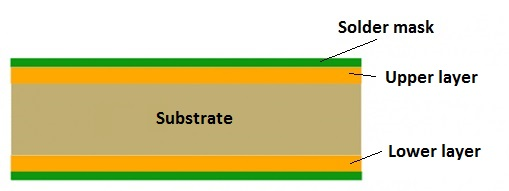

2. **Copper Layers:**

   - Thin layers of copper foil are laminated onto the substrate. These copper layers serve as the conductive paths for electrical signals.

3. **Circuit Design:**

   - The circuit design is created using Computer-Aided Design (CAD) software. The design specifies the placement of components, the routing of traces, and the location of holes for mounting.

4. **Components:**

   - Electronic components such as resistors, capacitors, integrated circuits, and connectors are mounted onto the PCB. These components are soldered onto the copper traces.

5. **Copper Traces:**

   - Copper traces form the conductive pathways on the PCB, connecting the various components according to the circuit design. Traces can be on one or both sides of the PCB.

6. **Through-Hole Technology (THT) and Surface Mount Technology (SMT):**
   - THT involves mounting components by inserting their leads through holes in the PCB and soldering them on the opposite side.
   - SMT involves placing components directly onto the surface of the PCB and soldering them in place.

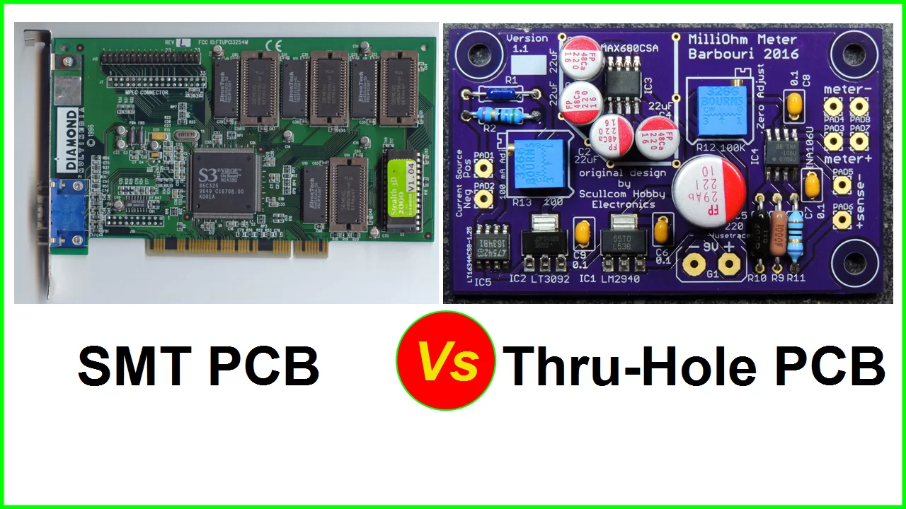

7. **Vias:**

   - Vias are plated holes that connect different layers of the PCB, allowing traces to pass through from one side to the other.

8. **Silkscreen:**
   - A silkscreen layer provides reference markings, labels, and component designators on the PCB to aid in assembly and troubleshooting.
<!-- 
**How PCBs Work:**

1. **Electrical Connections:**

   - PCBs provide a platform for creating electrical connections between various components. The copper traces on the PCB act as conductive paths, allowing electricity to flow between different parts of the circuit.

2. **Component Mounting:**

   - Components are mounted on the PCB in specific locations according to the circuit design. The physical arrangement ensures that the electrical connections between components are established correctly.

3. **Signal Routing:**

   - Copper traces route signals between components, facilitating the flow of data and electrical signals within the circuit.

4. **Electrical Isolation:**

   - The non-conductive substrate material ensures that copper traces do not unintentionally connect with each other, providing electrical isolation between different parts of the circuit.

5. **Compact Design:**

   - PCBs enable a compact and organized layout of electronic components, reducing the overall size of electronic devices and enhancing their reliability.

6. **Scalability:**
   - PCBs can be designed for various levels of complexity, from simple single-layer boards to complex multi-layer boards, depending on the requirements of the electronic device. -->

# Computer:

an electronic device for storing and processing data, typically in binary form, according to instructions given to it in a variable program. It is designed to perform various tasks by executing a set of instructions called programs. Computers come in various forms, including personal computers, servers, mainframes, and embedded systems in devices like smartphones and appliances. The basic components of a computer system include hardware, software, data, and the user.

## Software:

Software is a set of instructions, programs, or data that enables a computer to perform specific tasks or functions. It is a non-physical component of a computer system that provides the necessary instructions for the hardware to operate and execute various operations. Software can be broadly categorized into two main types:

## Hardware:

Hardware refers to the physical components of a computer system that you can touch and see. These components are essential for the computer to function and execute tasks. Hardware includes devices such as the central processing unit (CPU), memory (RAM), storage devices (hard drives, SSDs), input devices (keyboard, mouse), output devices (monitor, printer), and various other peripherals like graphics cards, network cards, and motherboards. In essence, hardware provides the tangible infrastructure necessary for the execution of software and the processing of data within a computer system.

Computer hardware consists of various physical components that work together to enable the functioning of a computer system. Here are the main components of computer hardware:

1. **Central Processing Unit (CPU):**
   - Often referred to as the brain of the computer.
   - Executes instructions and performs calculations.
   - Comprises components like the Control Unit, Arithmetic Logic Unit (ALU), and registers.

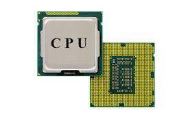

2. **Memory (RAM - Random Access Memory):**
   - Provides temporary storage for data and program instructions that the CPU is currently using.
   - Data in RAM is volatile and is lost when the computer is powered off.

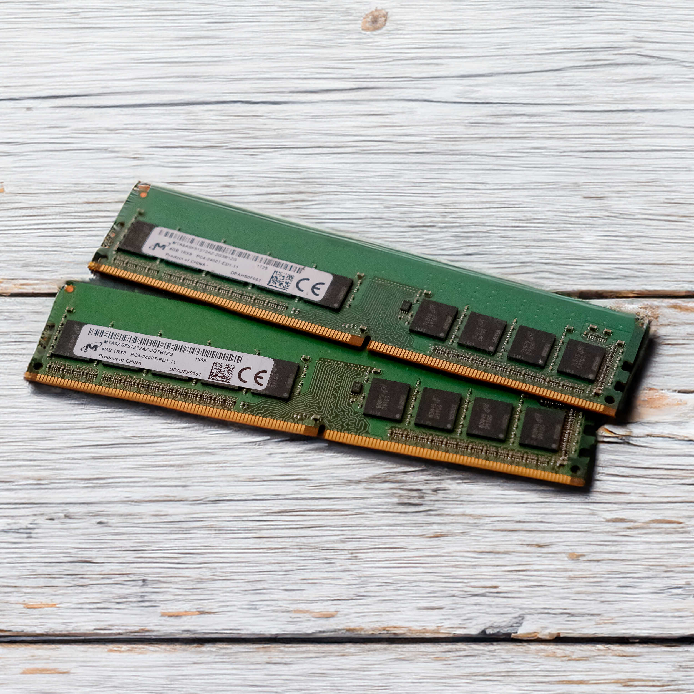

3. **Storage Devices:**
   - **Hard Disk Drive (HDD):** Provides long-term, non-volatile storage for the operating system, software, and user data.
   - **Solid State Drive (SSD):** Similar to an HDD but uses flash memory for faster data access.
   - **Optical Drives (e.g., CD/DVD/Blu-ray):** Used for reading and writing optical discs.

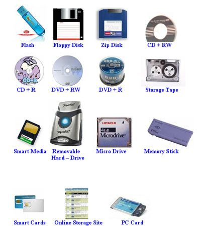

4. **Motherboard:**
   - The main circuit board that houses the CPU, memory, and connects other peripheral devices.
   - Provides interfaces for various components to communicate with each other.

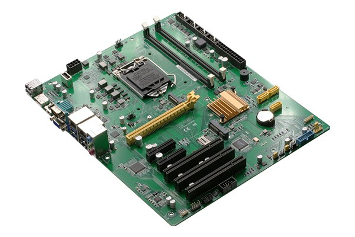

5. **Power Supply Unit (PSU):**
   - A switched-mode power supply (SMPS) is an electronic circuit that converts power using switching devices that are turned on and off at high frequencies, and storage components such as inductors or capacitors to supply power when the switching device is in its non-conduction state.
   - It supplies power to the motherboard, CPU, and other components.

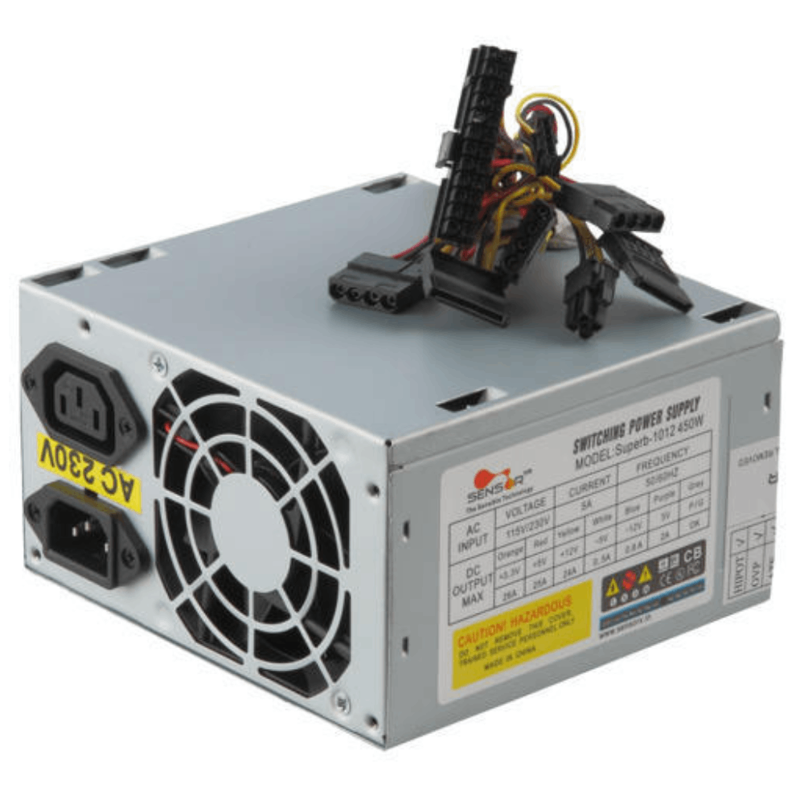

6. **Graphics Processing Unit (GPU):**
   - Responsible for rendering graphics and images.
   - Often used in conjunction with a CPU to enhance graphical performance, especially in gaming and multimedia applications.

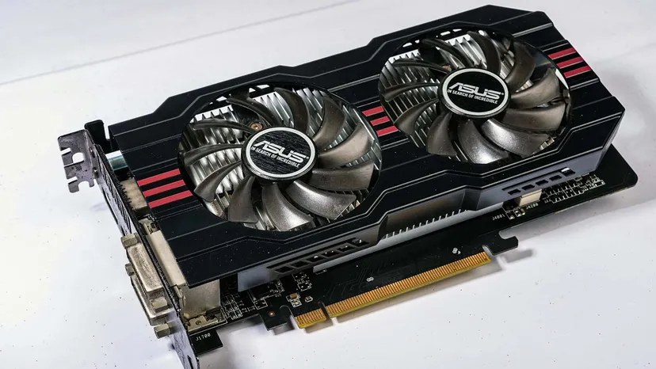

7. **Input Devices:**
   - **Keyboard:** Allows users to input text and commands.
   - **Mouse/Touchpad:** Enables pointing and clicking.
   - **Scanner:** Converts physical documents or images into digital format.

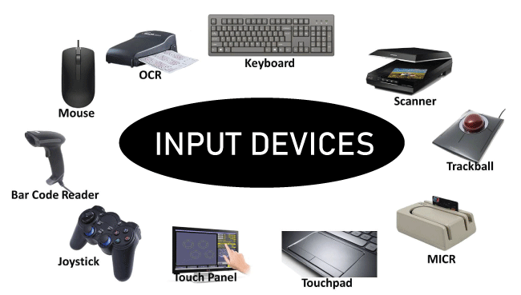

8. **Output Devices:**
   - **Monitor/Display:** Displays visual output.
   - **Printer:** Produces a hard copy of documents.
   - **Speakers:** Outputs audio.

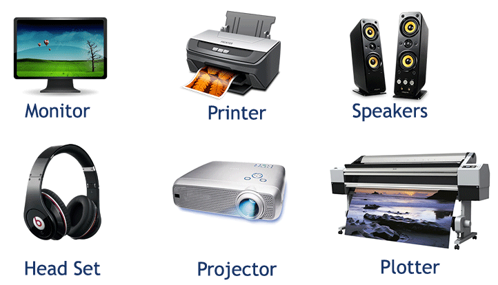

9. **Networking Components:**
   - **Network Interface Card (NIC):** Facilitates communication over a network.
   - **Router:** Manages network traffic and connects the computer to the internet or other networks.

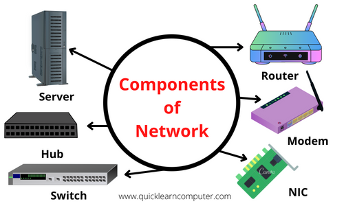

10. **Expansion Cards:**
    - **Graphics Card:** Enhances graphical capabilities.
    - **Sound Card:** Improves audio output.

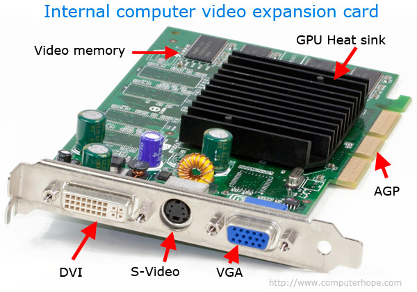

11. **Cooling Systems:**
    - **Fans/Heat Sinks:** Prevents overheating of components, especially the CPU and GPU.

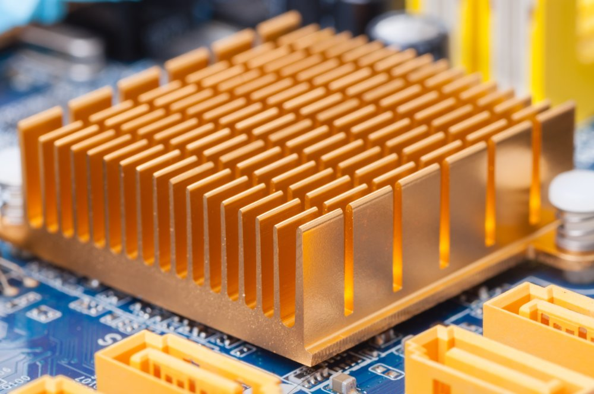

12. **Cables and Connectors:**
    - Various cables and connectors to link different components.

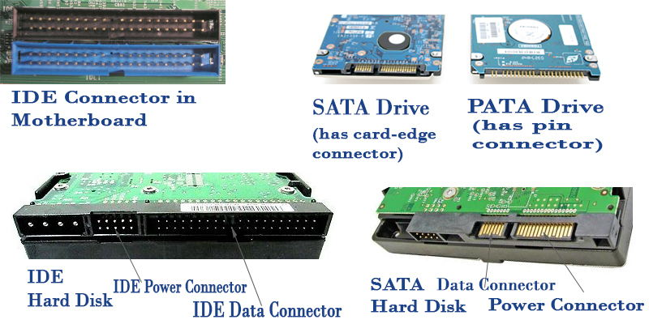

13. **Peripheral Devices:**
    - Devices that connect to the computer to provide additional functionality, such as printers, scanners, and external storage devices.

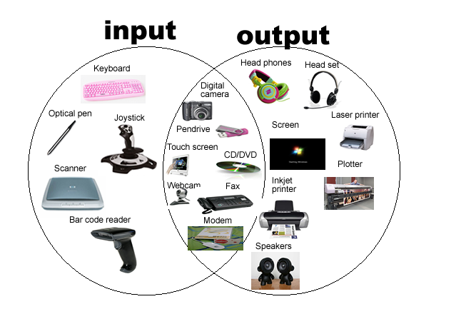

# SMPS (Switched-Mode Power Supply):

A Switched-Mode Power Supply (SMPS) is a type of power supply that efficiently converts electrical power from one form to another using switching devices. It is widely used in electronic devices, computers, and other applications where a stable and regulated power supply is essential. Here are the key aspects of an SMPS:

1. **Switching Operation:**

   - The core principle of an SMPS is the use of electronic switches (transistors) to rapidly switch the input voltage on and off.
   - This high-frequency switching allows for efficient transformation of electrical power.

2. **Stages of Operation:**

   - **Rectification:** Converts the incoming alternating current (AC) into direct current (DC).
   - **Filtering:** Smoothens the DC waveform by reducing ripple and noise.
   - **Switching:** Uses electronic switches to chop the DC voltage into high-frequency pulses.
   - **Transformation:** Transforms the high-frequency pulses into the desired output voltage using an inductor and transformer.
   - **Rectification (Output):** Converts the high-frequency AC back to DC at the desired output voltage.
   - **Filtering (Output):** Further filters the output to reduce any remaining ripple.

3. **Advantages of SMPS:**

   - **Efficiency:** SMPS is more efficient compared to traditional linear power supplies because it minimizes energy loss in the form of heat.
   - **Compact Size:** SMPS units are generally smaller and lighter than their linear counterparts, making them suitable for compact electronic devices.
   - **Variable Output Voltage:** The output voltage of an SMPS can be easily adjusted, making it versatile for different applications.
   - **Regulated Output:** SMPS provides a stable and regulated output voltage even with variations in the input voltage.

4. **Applications:**

   - SMPS is used in a wide range of electronic devices, including computers, laptops, TVs, audio amplifiers, and other consumer electronics.
   - It is commonly employed in situations where efficiency, compact size, and regulated power are crucial.

## **Types of SMPS:**

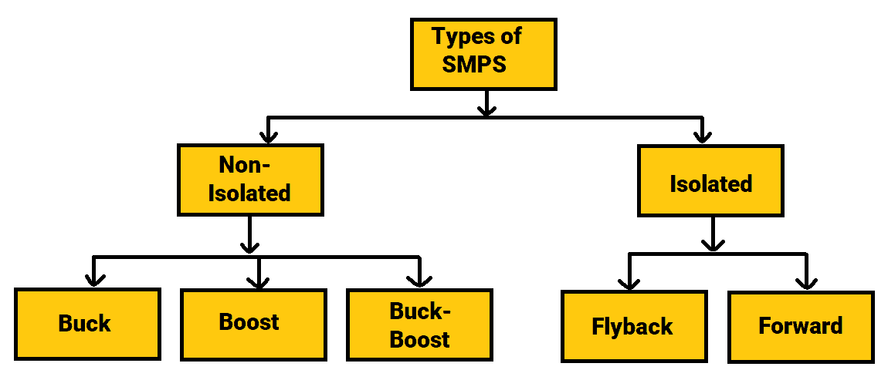
   
   - **Buck Converter:** Converts a higher DC voltage to a lower DC voltage.
   - **Boost Converter:** Converts a lower DC voltage to a higher DC voltage.
   - **Buck-Boost Converter:** Converts a higher DC voltage to a lower DC voltage or vice versa.
   - **Flyback Converter:** Converts a DC voltage to a higher or lower DC voltage.
   - **Forward Converter:** Converts a DC voltage to a higher or lower DC voltage.
 
# Processor (Central Processing Unit - CPU):

The processor, also known as the Central Processing Unit (CPU), is a vital component of a computer system responsible for executing instructions and performing calculations. It acts as the "brain" of the computer, carrying out tasks and managing data within the system. Here are detailed aspects of a processor:

1. **Function:**

   - **Execution of Instructions:** The primary role of the CPU is to execute instructions stored in the computer's memory. These instructions come from software applications and the operating system.
   - **Arithmetic and Logic Operations:** The CPU performs arithmetic calculations (addition, subtraction, multiplication, division) and logical operations (comparisons) necessary for program execution.

2. **Components:**

   - **Control Unit (CU):** Manages the flow of data and instructions within the CPU and coordinates operations with other hardware components.
   - **Arithmetic Logic Unit (ALU):** Performs arithmetic and logical operations on data.
   - **Registers:** Small, fast storage locations within the CPU used for temporary data storage during processing. Registers include the instruction register, data register, and address register.

3. **Clock Speed:**

   - **Clock Rate:** Measured in Hertz (Hz), it represents the number of cycles per second the CPU can execute. A higher clock speed generally indicates faster processing. Modern CPUs have multi-core architectures, allowing them to handle multiple tasks simultaneously.

4. **Cache Memory:**

   - **L1, L2, L3 Caches:** These are small-sized, high-speed memory units located on or near the CPU die. They store frequently used instructions and data to reduce the time it takes to fetch information from the slower main memory (RAM).

5. **Instruction Set:**

   - **ISA (Instruction Set Architecture):** The set of instructions that a CPU can execute. Different CPUs may have different instruction sets, and this influences software compatibility and performance.

6. **Multithreading and Parallel Processing:**

   - **Multithreading:** Some CPUs support simultaneous execution of multiple threads, allowing for better utilization of resources and improved performance in multitasking scenarios.
   - **Parallel Processing:** In systems with multiple CPUs or cores, parallel processing enables the simultaneous execution of multiple instructions or tasks.

## Types of processors:

### Based on the number of cores:

1. **Single-Core Processor:**

   - A single-core processor is a CPU with a single processing unit (core) capable of executing instructions independently.
   - It is the simplest form of a CPU and is generally used in low-end, basic computing devices.
   - Single-core processors are not suitable for multitasking and resource-intensive applications.

2. **Multi-Core Processor:**
   - A multi-core processor is a CPU with multiple processing units (cores) on a single chip.
   - It is capable of executing multiple instructions simultaneously, improving performance in multitasking scenarios.
   - Multi-core processors are commonly used in modern computers, smartphones, and other devices.

### Based on the number of bits:

1. **32-bit Processor:**

   - A 32-bit processor is a CPU with a 32-bit register size, allowing it to process 32 bits of data at a time.
   - It can address up to 4 GB of RAM and is commonly used in older computers.
   - 32-bit processors are not compatible with 64-bit software.

2. **64-bit Processor:**
   - A 64-bit processor is a CPU with a 64-bit register size, allowing it to process 64 bits of data at a time.
   - It can address up to 16 exabytes of RAM and is commonly used in modern computers.
   - 64-bit processors are compatible with both 32-bit and 64-bit software.

### Based on the manufacturer:

1. **Intel Processor:**

   - Intel is a leading manufacturer of CPUs for desktop and laptop computers.
   - Popular Intel processors include the Core i3, Core i5, and Core i7 series.

2. **AMD Processor:**

   - AMD is a leading manufacturer of CPUs for desktop and laptop computers.
   - Popular AMD processors include the Ryzen 3, Ryzen 5, and Ryzen 7 series.

3. **ARM Processor:**
   - ARM is a leading manufacturer of CPUs for mobile devices and embedded systems.
   - Popular ARM processors include the Exynos by samsung, M1,M2 from apple,Snapdragon by Qualcomm, and Kirin by Huawei.

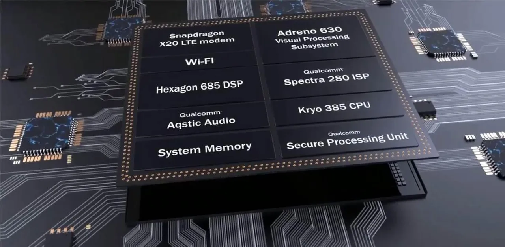

### Based on the Instruction Set Architecture (ISA):

1.  **CISC (Complex Instruction Set Computer):**
    - A CISC processor is a CPU that supports a large set of instructions.
    - It is capable of executing complex instructions in a single clock cycle.
    - CISC processors are generally more efficient in terms of code size but less efficient in terms of execution speed.
    - Examples include the Intel x86 and AMD x86-64 architectures.
2.  **RISC (Reduced Instruction Set Computer):**
    - A RISC processor is a CPU that supports a small set of instructions.
    - It is capable of executing simple instructions in a single clock cycle.
    - RISC processors are generally more efficient in terms of execution speed but less efficient in terms of code size.
    - Examples include the ARM and MIPS architectures.
3.  **Hybrid:**
    - A hybrid processor is a CPU that combines the features of both CISC and RISC architectures.
    - It is capable of executing both simple and complex instructions efficiently.
    - Examples include the Intel x86-64 and ARMv8 architectures.

# Motherboard:

**Motherboard:**

A motherboard is the main printed circuit board (PCB) in a computer that houses and connects various essential components, allowing them to communicate and work together. It serves as the central platform for the CPU, memory, storage, and other peripherals. Here are the key aspects of a motherboard:

1. **Form Factor:**

   - The form factor of a motherboard determines its physical size, shape, and layout. Common form factors include ATX (Advanced Technology eXtended), microATX, and Mini-ITX.

2. **Components on the Motherboard:**
   - **CPU Socket:** The socket where the central processing unit (CPU) is installed.
   - **RAM Slots:** Slots for installing system memory (RAM).
   - **Expansion Slots:** PCI Express (PCIe) slots for adding expansion cards like graphics cards, sound cards, and network adapters.
   - **Storage Connectors:** SATA ports for connecting hard drives and SSDs.
   - **Power Connectors:** Connectors for supplying power to the motherboard.
   - **Connectors for Front Panel:** Interfaces for power button, reset button, USB ports, audio jacks, etc.
   - **BIOS/UEFI Chip:** Holds the firmware that initializes the hardware during the boot process.
   - **Chipset:** Manages data flow between the CPU, memory, storage, and peripherals.
   - **Input/Output Ports:** USB ports, audio jacks, HDMI/DisplayPort connectors, and other I/O ports are typically available on the motherboard's rear I/O panel.
   - **Networking:** Motherboards may have built-in Ethernet ports for wired networking. Some also include Wi-Fi adapters.
   - **Audio:** Integrated audio components or audio chipsets, along with audio jacks, provide sound capabilities.
   - **Cooling:** Motherboards may include heatsinks, fans, and other cooling components to prevent overheating.

## Types of Motherboards:

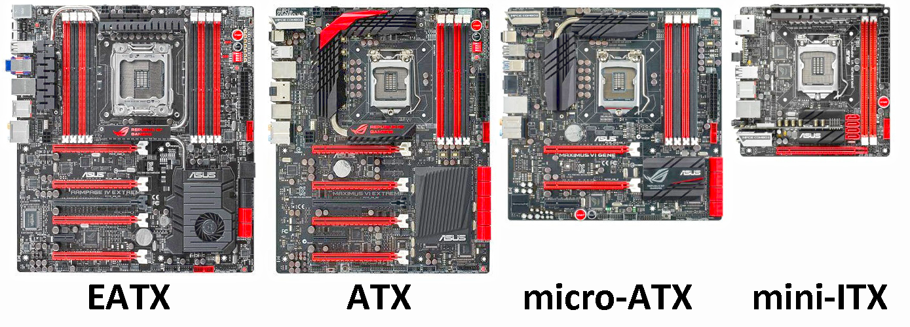

1. **Extended ATX (E-ATX):**

   - Larger than standard ATX, designed for enthusiasts and high-end systems.
   - Offers additional PCIe and RAM slots.

2. **ATX (Advanced Technology eXtended):**

   - Standard size for desktop computers.
   - Offers multiple PCIe slots and RAM slots.
   - Common in gaming and high-performance systems.

3. **MicroATX:**

   - Smaller form factor compared to ATX.
   - Suitable for smaller desktops with fewer expansion slots.

4. **Mini-ITX:**

   - Compact form factor, often used in small form factor (SFF) and HTPC (Home Theater PC) builds.
   - Limited expansion slots but suitable for compact and energy-efficient systems.

5. **Mini-STX:**
   - Ultra-compact form factor, smaller than Mini-ITX.
   - Used in extremely compact systems or embedded applications.

# Ports and Connectors:

| **Type**                      | **Description**                                       | **Use**                                            | **Image**                                       |
|-------------------------------|-------------------------------------------------------|----------------------------------------------------|-------------------------------------------------|
| **USB (Universal Serial Bus)** | Connects various peripherals and external devices.    | Printers, keyboards, mice, external drives, etc.    | 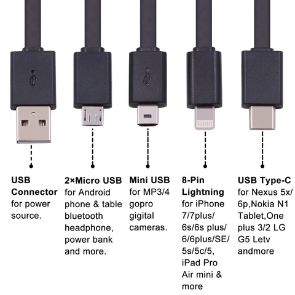      |
| **HDMI (High Definition Multimedia Interface)** | Transmits high-definition video and audio.    | Connects computers to monitors/TVs, multimedia devices. | 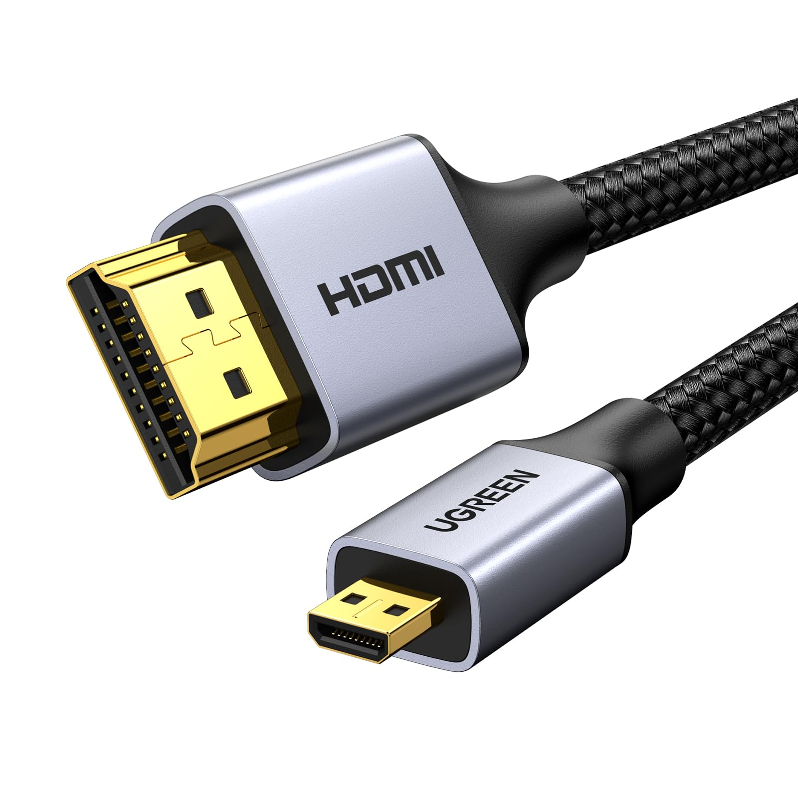    |
| **Ethernet (RJ45)**           | Enables wired network connections.                    | Connects to a local network for internet access.   | 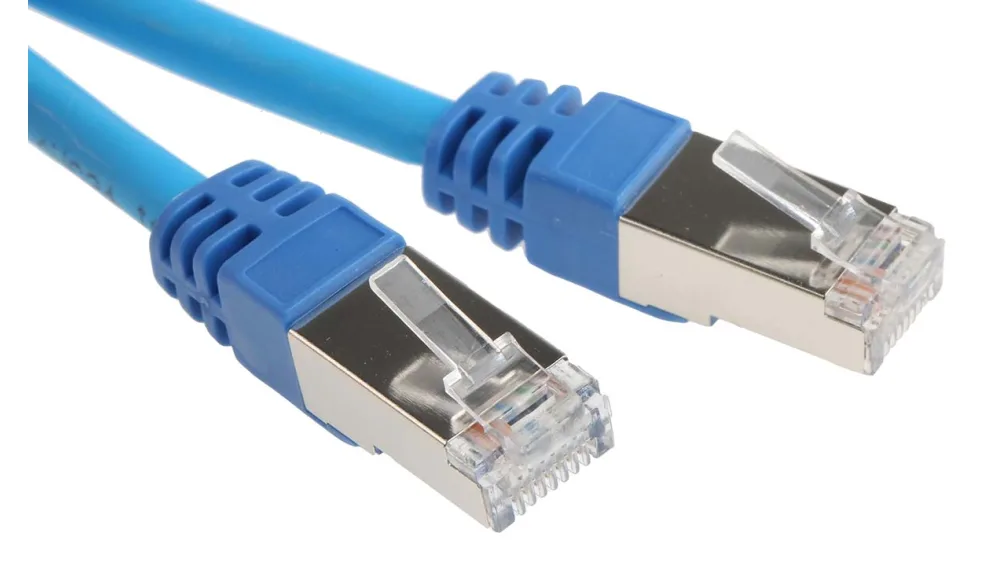 |
| **Audio Jack (3.5mm)**        | Audio input/output for headphones and microphones.    | Connects speakers, headphones, microphones.         | 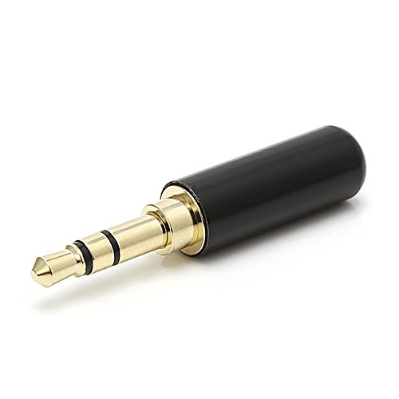 |
| **DisplayPort**               | Video and audio interface for high-quality displays.  | Similar to HDMI, connects monitors and graphics cards. | 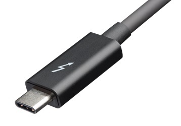 |
| **Thunderbolt**               | High-speed data transfer and video connectivity.      | Connects external storage, displays, and peripherals.| 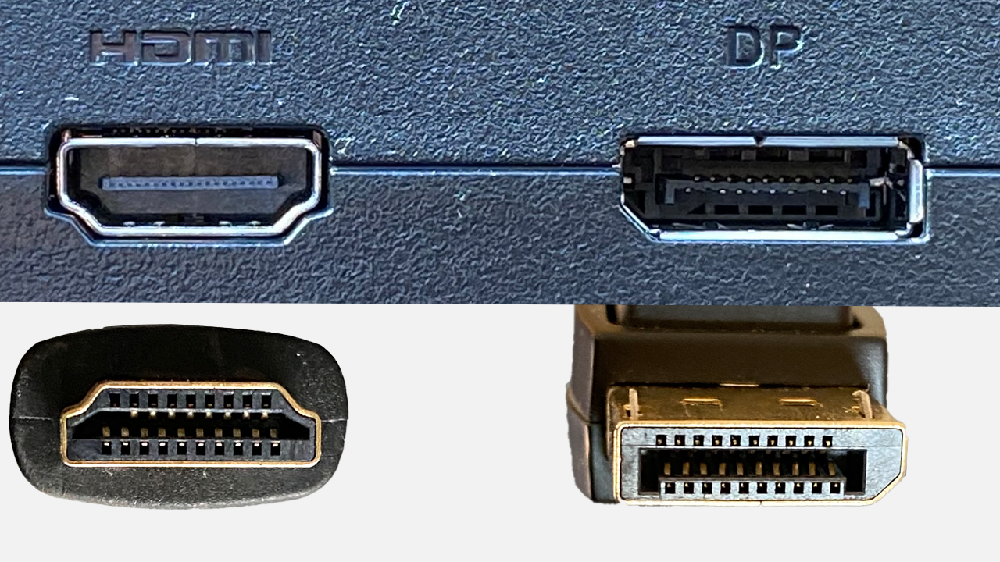|
| **VGA (Video Graphics Array)**| Analog video connection for older displays.           | Older monitors and projectors.                       | 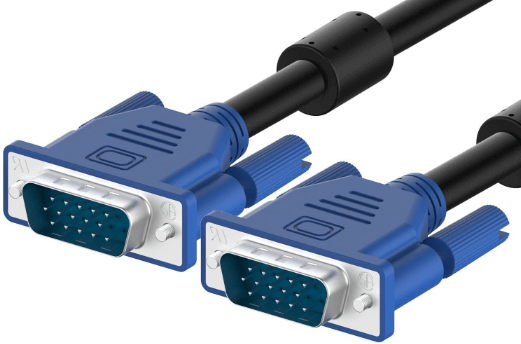      |
| **DVI (Digital Visual Interface)** | Transmits digital video signals.                 | Monitors, projectors, and some older graphics cards. | 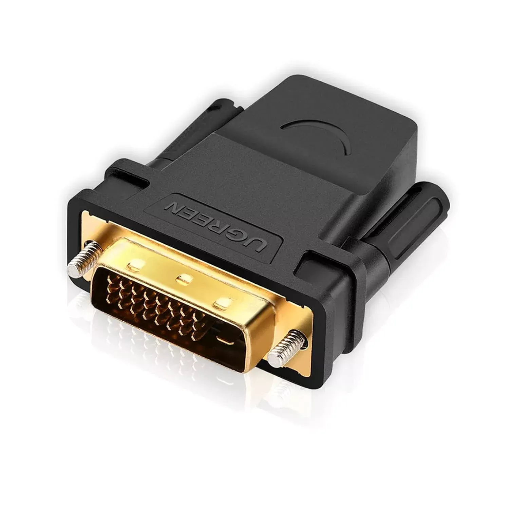      |
| **PS/2**                      | Used for connecting keyboards and mice.               | Older keyboards and mice.                            |      |
| **eSATA (External SATA)**     | External SATA connection for fast data transfer.     | External hard drives with eSATA support.            | 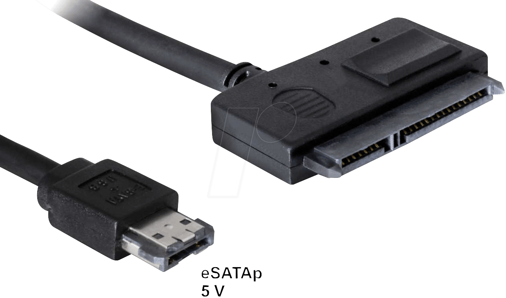  |
| **SD Card Slot**              | For reading SD (Secure Digital) memory cards.         | Cameras, smartphones, and other devices.            | 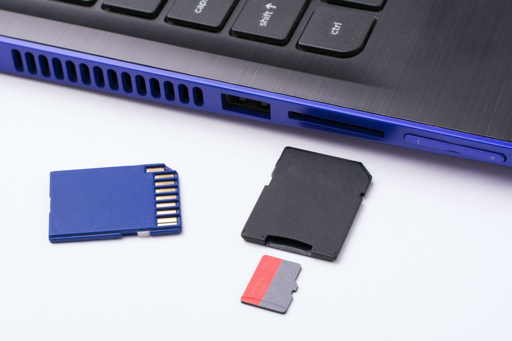 |
| **Mini DisplayPort**          | Similar to DisplayPort, used in compact devices.      | Connects laptops to external monitors.               | 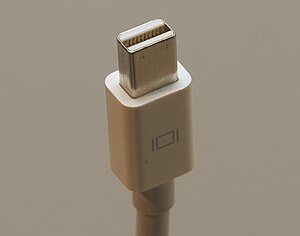|

