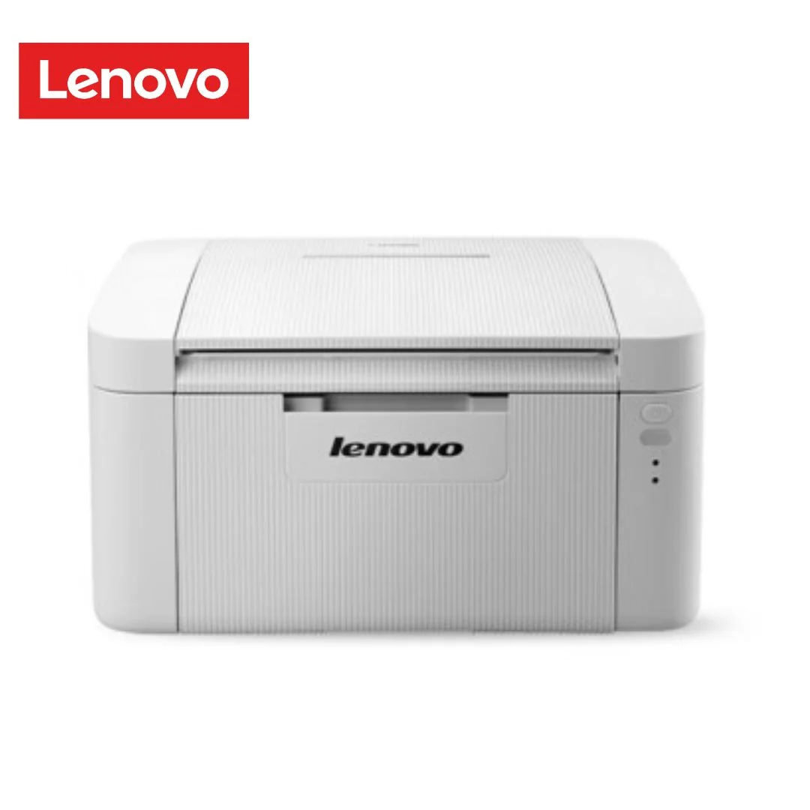
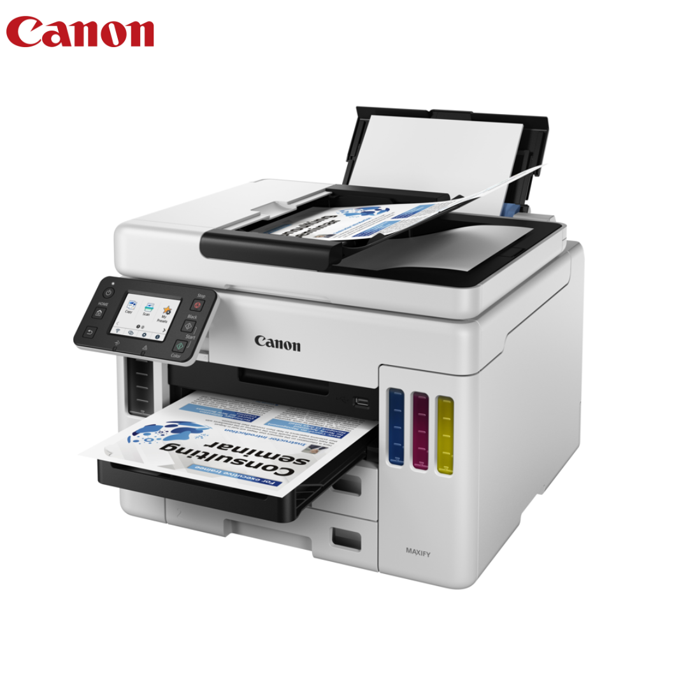
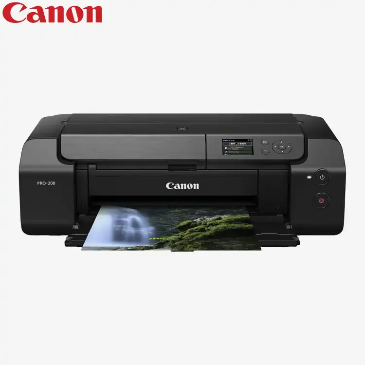
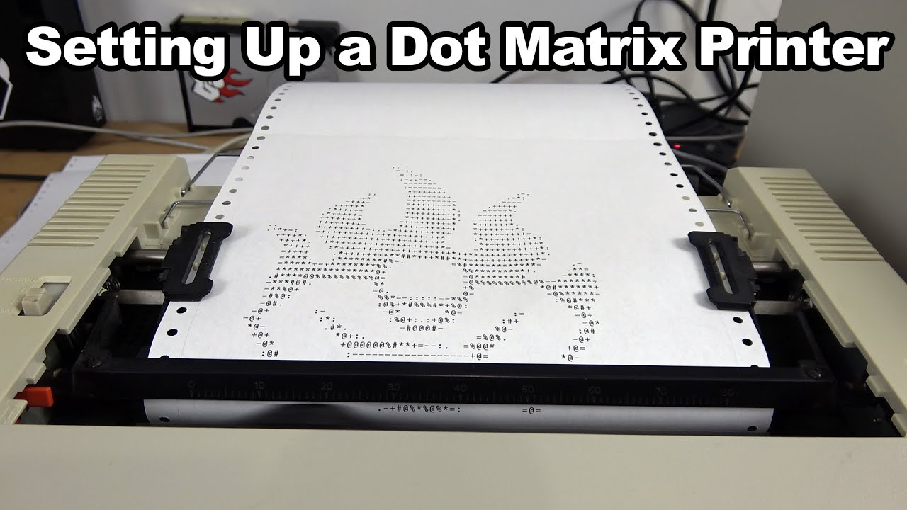
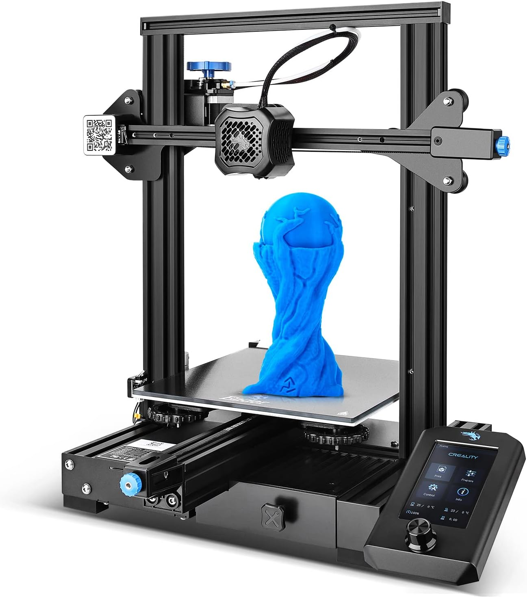
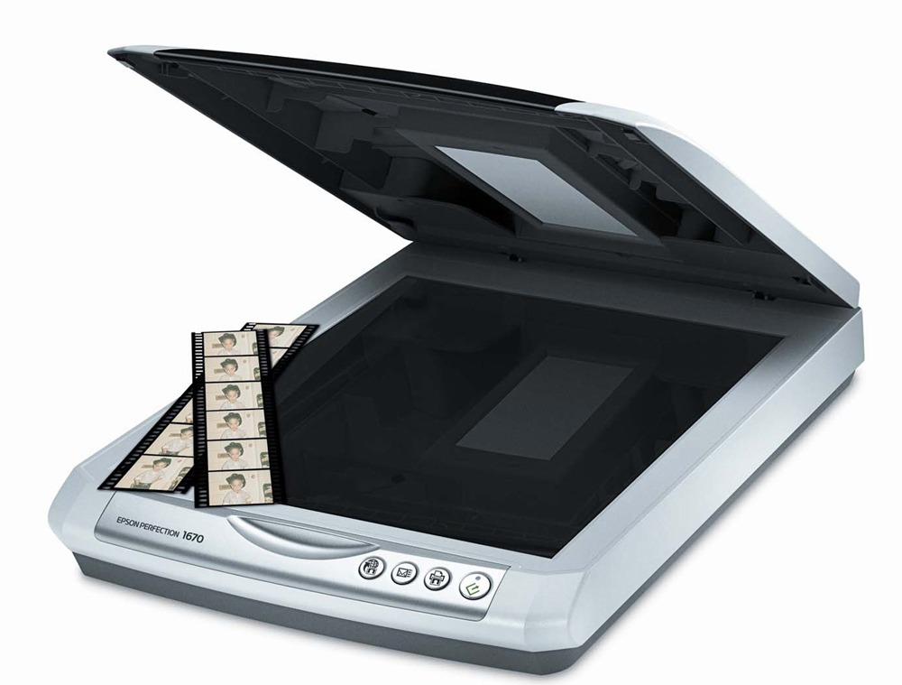
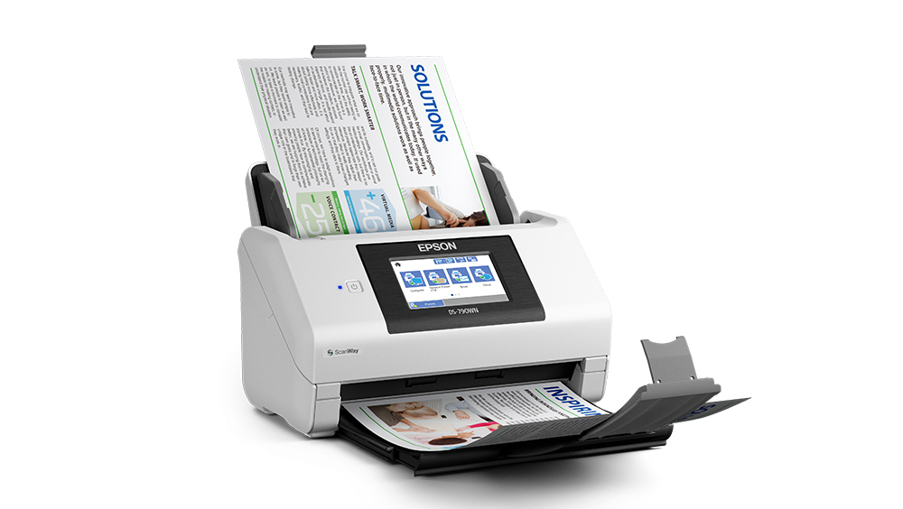
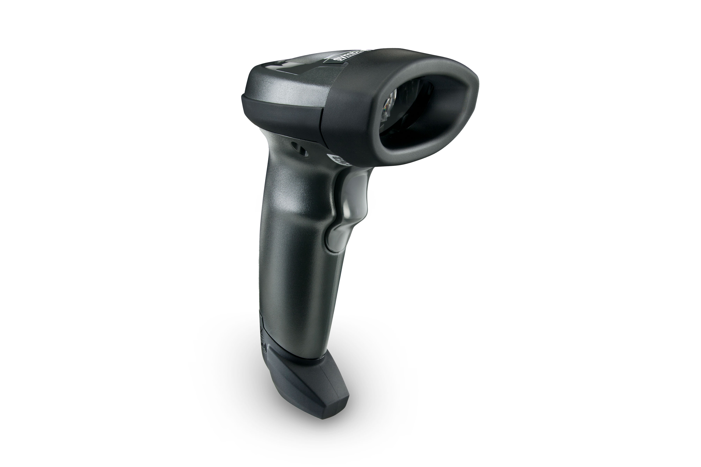
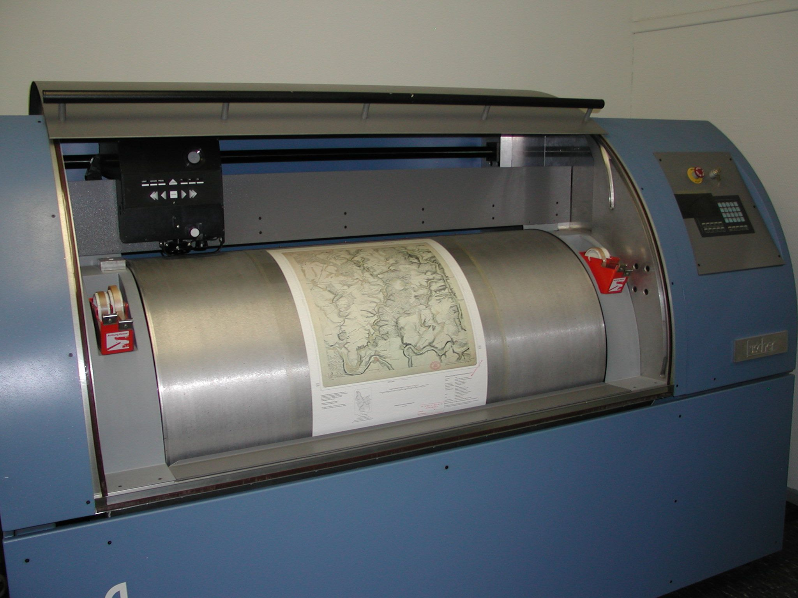
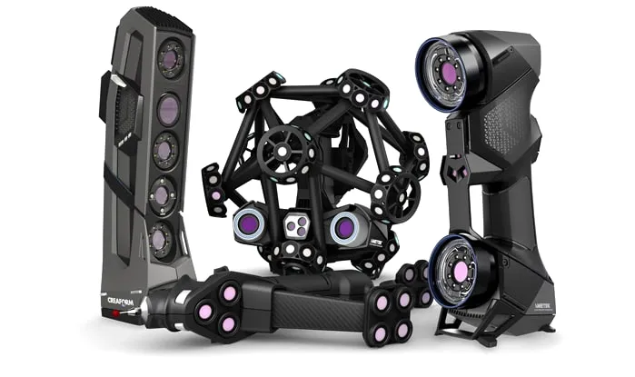

# Printers:

Printers are devices used to produce hard copies of digital documents or images on paper or other physical media. They come in various types, each suited to different needs:

1. **Inkjet Printers:**
   - Use liquid ink sprayed through microscopic nozzles onto the paper.
   - Suitable for high-quality photo printing and color documents.
   - Can be either single-function (print-only) or multifunction (print, scan, copy).
   - Generally affordable upfront costs but may have higher ongoing ink expenses.

2. **Laser Printers:**
   - Utilize toner cartridges and a laser to create text and images on paper.
   - Faster printing speeds compared to inkjet printers.
   - Ideal for high-volume printing and text-based documents.
   - Often found in office environments.

3. **All-in-One Printers (Multifunction Printers):**
   - Combine printing, scanning, copying, and sometimes faxing capabilities into a single device.
   - Offer versatility and space-saving benefits.
   - Available in both inkjet and laser variants.

4. **Photo Printers:**
   - Specialized printers designed specifically for printing high-quality photographs.
   - Often use additional ink colors to achieve better color accuracy.
   - May support various paper sizes and finishes optimized for photo printing.

5. **Dot Matrix Printers:**
   - Utilize a matrix of pins striking an ink-soaked ribbon to produce characters on paper.
   - Mostly used in environments requiring multipart forms or continuous paper.
   - Relatively slow and noisy compared to modern printers but still find niche use cases.

6. **3D Printers:**
   - Create three-dimensional objects by adding successive layers of material (plastic, resin, metal, etc.).
   - Used in prototyping, manufacturing, education, and even medical fields.
   - Offer various printing technologies such as FDM (Fused Deposition Modeling) and SLA (Stereolithography).

# Scanners:

Scanners are devices used to convert physical documents, photos, or objects into digital images or files. They also come in different types:

1. **Flatbed Scanners:**
   - Common type where documents are placed on a flat glass surface for scanning.
   - Ideal for scanning documents, photos, and other flat materials.
   - Offer higher resolution and quality compared to other scanner types.

2. **Sheetfed Scanners:**
   - Designed to feed documents automatically through the scanner.
   - Suitable for scanning large batches of documents quickly.
   - Often used in office environments for document digitization.

3. **Handheld Scanners:**
   - Portable scanners that are moved manually over the document.
   - Offer convenience for scanning documents that cannot be easily moved.
   - Available in various sizes and resolutions.

4. **Drum Scanners:**
   - High-end scanners primarily used for professional or specialized applications.
   - Utilize a rotating drum to capture the image with high precision and quality.
   - Expensive and typically found in prepress and publishing industries.

5. **Slide and Film Scanners:**
   - Designed specifically for scanning photographic slides, negatives, and film.
   - Offer high resolution and color accuracy for digitizing analog images.

6. **3D Scanners:**
   - Capture three-dimensional shapes and textures of physical objects.
   - Used in fields like reverse engineering, quality control, and digital archiving.
   - Available in various technologies such as laser, structured light, and photogrammetry.

# Printer and Scanner Connectivity:

### Installing Printer:

1. **Connect the Printer:**

   - Ensure that your printer is connected to your computer via USB, Ethernet, Wi-Fi, or Bluetooth, depending on the printer's connectivity options.

2. **Turn on the Printer:**

   - Power on your printer and make sure it's ready for setup.

3. **Automatic Installation (Plug and Play):**

   - Windows 10 usually detects most printers automatically and installs basic drivers. If your printer supports plug-and-play installation, Windows will typically recognize it and install the necessary drivers automatically.

4. **Manual Installation (Optional):**

   - If Windows doesn't automatically install the printer, you can manually add it by going to "Settings" > "Devices" > "Printers & scanners."
   - Click on "Add a printer or scanner" and follow the on-screen instructions to search for and install your printer.

5. **Install Manufacturer's Software (Optional):**

   - Visit the manufacturer's website to download and install the latest drivers and software for your printer.
   - Some printers offer additional features or better performance through manufacturer-provided software.

6. **Set as Default (Optional):**
   - Once the printer is installed, you can set it as the default printer by going to "Settings" > "Devices" > "Printers & scanners" and selecting your printer. Then click on "Manage" and choose "Set as default."

### Configuring Printer:

1. **Printer Preferences:**

   - Right-click on your printer from the "Printers & scanners" settings and select "Printing preferences."
   - Configure settings such as paper size, orientation, quality, and other print options according to your preferences.

2. **Printer Properties:**
   - You can access additional printer properties by right-clicking on your printer and selecting "Printer properties." Here, you can adjust advanced settings like print spooling, sharing, security, etc.

### Installing Scanner:

1. **Connect the Scanner:**

   - If your scanner is separate from your printer, ensure that it's connected to your computer via USB or another supported connection method.

2. **Automatic Installation (Plug and Play):**

   - Windows 10 often detects scanners automatically and installs basic drivers.
   - If your scanner is detected, it should appear in the "Printers & scanners" settings.

3. **Manual Installation (Optional):**

   - If Windows doesn't automatically detect your scanner, you can manually add it by going to "Settings" > "Devices" > "Printers & scanners" and clicking on "Add a printer or scanner."

4. **Install Manufacturer's Software (Optional):**
   - Visit the manufacturer's website to download and install the latest drivers and software for your scanner.
   - Manufacturer-provided software may offer additional features and better compatibility.

### Configuring Scanner:

1. **Scanner Settings:**

   - After installing the scanner, you can adjust its settings by going to "Settings" > "Devices" > "Printers & scanners."
   - Click on your scanner, then select "Manage" to access settings such as default scan location, file format, resolution, etc.

2. **Software Configuration (Optional):**
   - Some scanners come with proprietary software that allows you to configure advanced scanning options. Check the manufacturer's website for any additional software or drivers that enhance scanning functionality.
