# Networking

Networking and internet setup refer to the process of configuring devices and connections to enable communication between devices and access to the internet. This setup is necessary for several reasons:

1. **Device Communication:** Networking allows devices such as computers, smartphones, printers, and other peripherals to communicate with each other, share resources, and access shared data.

2. **Internet Access:** Networking enables devices to connect to the internet, allowing users to browse websites, send emails, stream media, and access online services.

3. **File Sharing:** Networking enables file sharing between devices on the same network, making it easy to transfer files and collaborate on projects.

4. **Printer and Peripheral Sharing:** Networking allows multiple devices to share a single printer or other peripherals, reducing the need for multiple devices to have their own dedicated hardware.

5. **Remote Access:** Networking enables remote access to devices and resources, allowing users to access their files, devices, and applications from anywhere with an internet connection.

6. **Centralized Management:** Networking allows for centralized management of devices and resources, making it easier to configure, monitor, and troubleshoot devices on the network.

7. **Security:** Networking allows for the implementation of security measures such as firewalls, antivirus software, and encryption to protect devices and data from unauthorized access and cyber threats.

## Networking Components

Networking involves several components that work together to enable communication and data transfer between devices. Here are some key components:

1. **Router:** A router is a hardware device that connects multiple networks together. It forwards data packets between computer networks, allowing devices on different networks to communicate with each other. Routers are commonly used to connect a local area network (LAN) to the internet.

2. **Switch:** A switch is a hardware device that connects multiple devices within a network. It operates at the data link layer of the OSI model and forwards data packets between devices based on their MAC addresses. Switches are used to create LANs and provide high-speed connections between devices.

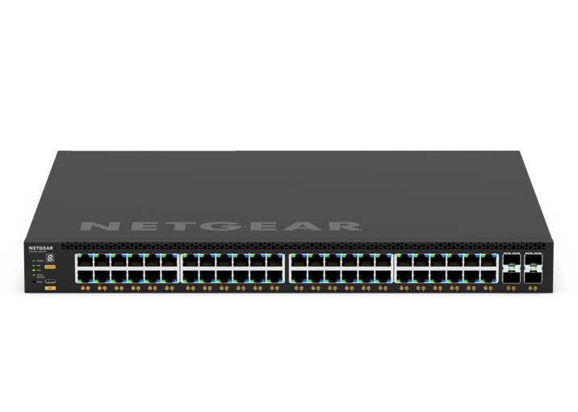

3. **Modem:** A modem (modulator-demodulator) is a device that modulates digital data from a computer into analog signals for transmission over telephone or cable lines, and demodulates incoming analog signals back into digital data. Modems are used to connect to the internet over DSL, cable, or fiber optic lines.

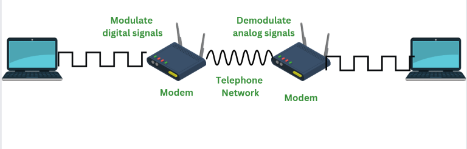

4. **Access Point:** An access point (AP) is a device that allows wireless devices to connect to a wired network using Wi-Fi. Access points are used to create wireless networks and extend the coverage of existing wired networks.

5. **Network Interface Card (NIC):** A network interface card (NIC) is a hardware component that allows a device to connect to a network. NICs can be integrated into the motherboard of a computer or installed as a separate card. They provide the physical connection between the device and the network medium (e.g., Ethernet cable).

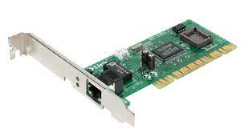

6. **Cables:** Cables are used to connect devices within a network. Common types of network cables include Ethernet cables (for wired connections) and fiber optic cables (for high-speed connections over longer distances).

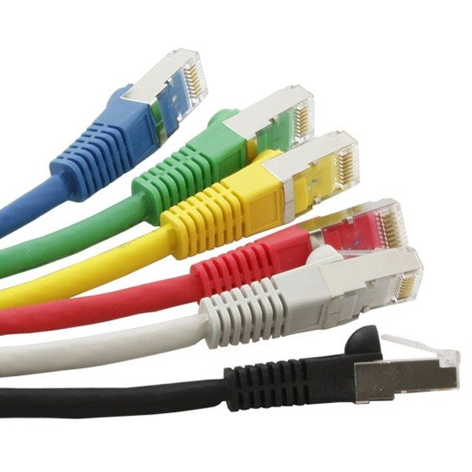

7. **Wireless Network Adapter:** A wireless network adapter is a device that allows a computer or other device to connect to a wireless network. It can be a built-in component or a separate USB adapter.

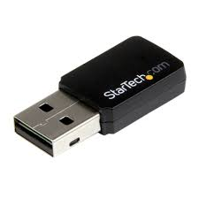

8. **Firewall:** A firewall is a security device or software that monitors and controls incoming and outgoing network traffic based on predetermined security rules. Firewalls are used to protect networks from unauthorized access and cyber attacks.

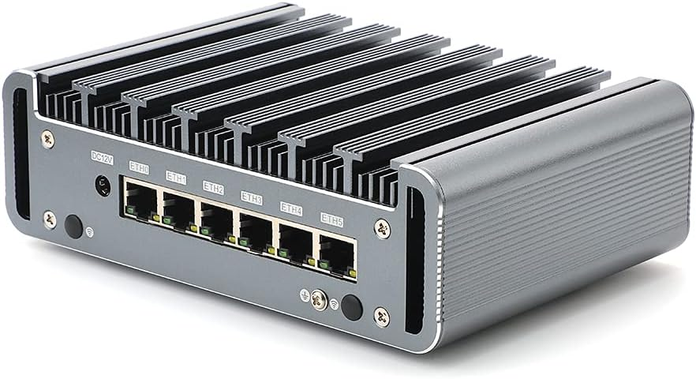

9. **Network Attached Storage (NAS):** NAS is a storage device that is connected to a network and provides file storage and sharing services to other devices on the network. NAS devices are often used for backup, file sharing, and multimedia streaming.

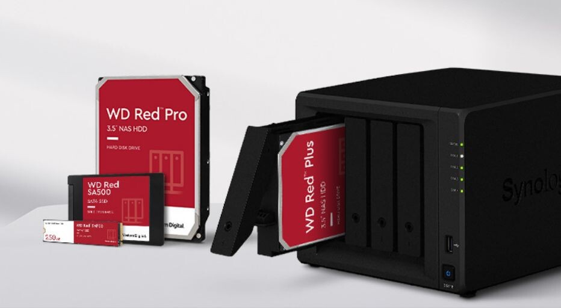

## Introduction to Computer Networks

A computer network is a collection of interconnected devices that can communicate with each other to share resources and information. Networks can be classified based on their size, geographic scope, and the technologies used to connect devices. Common types of networks include:

- Local Area Network (LAN): A LAN connects devices within a limited geographic area, such as a home, office, or campus. Ethernet and Wi-Fi are commonly used technologies for LANs.

- Wide Area Network (WAN): A WAN spans a large geographic area, such as a city, country, or even globally. WANs connect multiple LANs and often use technologies like leased lines, satellite links, and the internet.

- Metropolitan Area Network (MAN): A MAN covers a larger geographic area than a LAN but smaller than a WAN. It typically serves a city or metropolitan area and can connect multiple LANs.

- Personal Area Network (PAN): A PAN is a small network that connects devices within the immediate vicinity of an individual, such as a smartphone, tablet, and wearable devices.

**Network Topologies:**

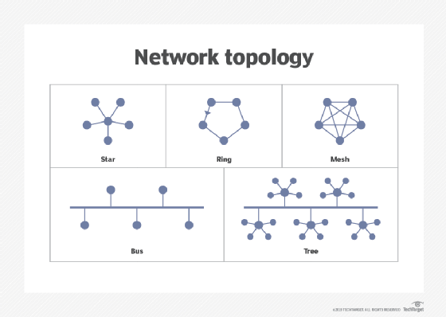

Network topology refers to the physical or logical layout of a network, including how devices are connected and how data flows between them. Common network topologies include:

- Bus Topology: In a bus topology, all devices are connected to a central cable, known as the bus. Data is transmitted down the bus, and each device receives the data but only processes data intended for it.

- Star Topology: In a star topology, each device is connected directly to a central hub or switch. All data passes through the hub, which manages the flow of data between devices.

- Ring Topology: In a ring topology, each device is connected to two other devices, forming a ring. Data travels around the ring in one direction, with each device passing data to the next until it reaches its destination.

- Mesh Topology: In a mesh topology, each device is connected to every other device in the network. This provides redundant paths for data to travel, increasing reliability but requiring more cabling.

**Wired and Wireless Networking Media:**

- Wired Networking Media: Wired networks use physical cables to connect devices. Common types of wired networking media include:

  - Ethernet cables: Used in Ethernet networks to connect devices to switches, routers, and other network devices.
  - Fiber optic cables: Used for high-speed, long-distance connections, fiber optic cables use light to transmit data.

- Wireless Networking Media: Wireless networks use radio waves or infrared signals to transmit data between devices. Common wireless networking media include:
  - Wi-Fi: A wireless networking technology that allows devices to connect to a LAN without the need for physical cables.
  - Bluetooth: A short-range wireless technology used for connecting devices like smartphones, tablets, and peripherals.

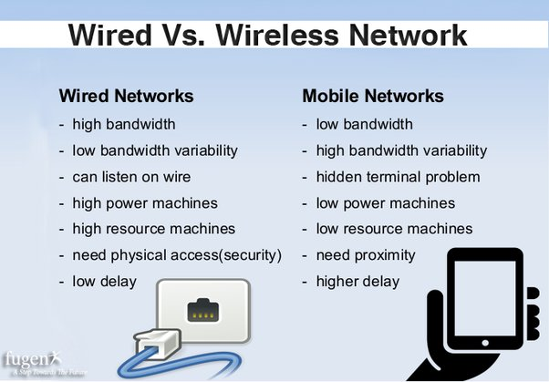

## Network Cabling:

Network cabling refers to the physical medium used to transmit data between devices on a network. The choice of cabling depends on factors such as the network topology, the speed and distance requirements, and the budget. Common types of network cabling include:

1. **Twisted Pair Cable:** Twisted pair cable consists of pairs of insulated copper wires twisted together. It is the most common type of cabling used in Ethernet networks. Twisted pair cable is classified into two main categories:

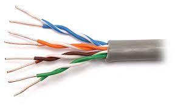

- Unshielded Twisted Pair (UTP): UTP cable is used in most Ethernet networks. It is affordable and easy to install but is more susceptible to electromagnetic interference (EMI).
- Shielded Twisted Pair (STP): STP cable has an additional shielding to protect against EMI. It is used in environments with high EMI, such as industrial settings.

2. **Coaxial Cable:** Coaxial cable consists of a single copper conductor surrounded by insulation, a braided metal shield, and an outer jacket. It is commonly used in cable television (CATV) and broadband internet connections.

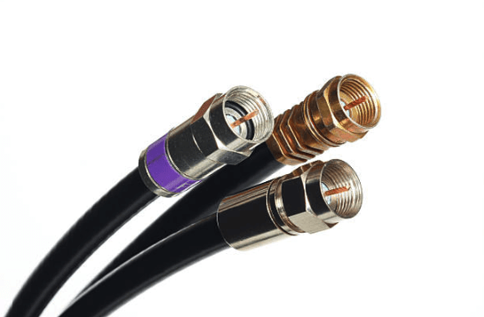

3. **Fiber Optic Cable:** Fiber optic cable uses optical fibers to transmit data as pulses of light. It offers high-speed and long-distance transmission capabilities and is immune to EMI. Fiber optic cable is commonly used in backbone networks and high-speed internet connections.

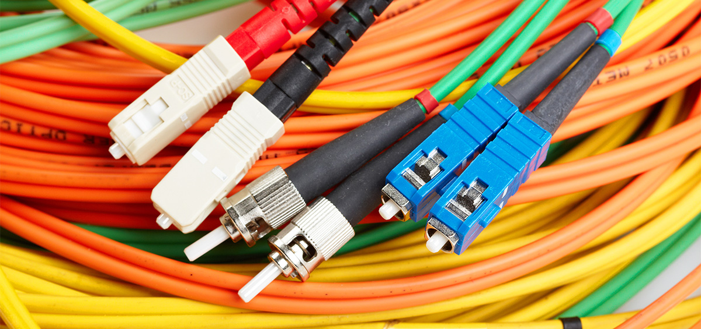

### Ethernet Connectors

- **RJ45 Connector:** The RJ45 connector is used to terminate twisted pair cables, such as Cat5e, Cat6, and Cat6a cables. It is the standard connector for Ethernet networks.
- **Ethernet Cable Types:** Common types of Ethernet cables include Cat5e, Cat6, and Cat6a cables, which support different speeds and bandwidths.

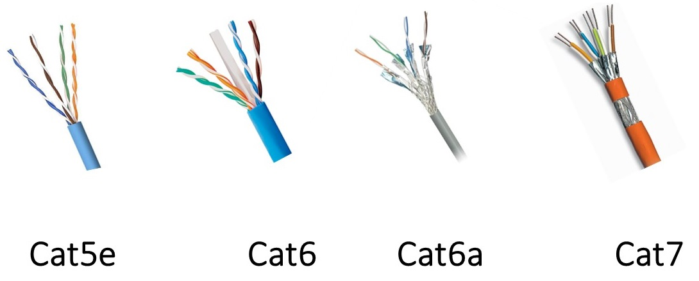

## IP Address Setting:

IP (Internet Protocol) addresses are used to identify devices on a network. There are two types of IP addresses: IPv4 and IPv6. IPv4 addresses are the most common and are typically written in the format "xxx.xxx.xxx.xxx" (e.g., 192.168.1.1). IPv6 addresses are longer and written in hexadecimal format.

To set an IP address for a device on a network, follow these general steps:

1. **Access Network Settings:** Go to the network settings on the device you want to configure. This can usually be found in the control panel or system preferences.

2. **Select Manual (Static) IP Address:** Choose to manually set the IP address rather than using DHCP (Dynamic Host Configuration Protocol), which automatically assigns IP addresses.

3. **Enter IP Address:** Enter the desired IP address for the device. Make sure it is within the same subnet as other devices on the network and does not conflict with any other IP addresses.

4. **Enter Subnet Mask:** Enter the subnet mask for the network. This defines the range of IP addresses that are part of the same network.

5. **Enter Default Gateway:** Enter the IP address of the router or gateway on the network. This is used to route traffic to other networks or the internet.

6. **Enter DNS Server Addresses:** Enter the IP addresses of the DNS (Domain Name System) servers. These servers are used to translate domain names (e.g., www.example.com) into IP addresses.

7. **Save Settings:** Save the settings and restart the device if necessary for the changes to take effect.

### Sharing of Printer/Network Devices:

Sharing printers and other network devices allows multiple users to access them over the network. Here's how you can share a printer or other network devices:

1. **Enable Printer Sharing:** On the computer that is directly connected to the printer, go to printer settings and enable printer sharing. Give the printer a share name.

2. **Connect to the Shared Printer:** On other computers on the network, add a network printer. Search for the shared printer using its share name or IP address and install the printer driver.

3. **Access Shared Devices:** Once the printer is shared, other users on the network can access it as a network printer. They can print to the shared printer as if it were directly connected to their computer.

4. **Share Other Network Devices:** Similarly, other network devices such as scanners, external hard drives, and media servers can be shared by enabling sharing in their settings and accessing them from other devices on the network.

## Basic wireless AP configuration

Configuring a basic wireless Access Point (AP) involves setting up the AP with a network name (SSID), security settings, and other basic parameters. Here's a general outline of the steps involved:

1. **Access the AP's Configuration Interface:**

   - Connect a computer to the AP using an Ethernet cable or connect to the AP's default wireless network (if available).
   - Open a web browser and enter the AP's IP address in the address bar. This address is usually provided in the AP's documentation or can be found using a network scanning tool.

2. **Login to the AP's Configuration Interface:**

   - Enter the default username and password for the AP. This information is also provided in the documentation.
   - Once logged in, you will see the AP's configuration dashboard.

3. **Configure Basic Wireless Settings:**

   - Go to the wireless settings section of the dashboard.
   - Set the SSID (network name) for the wireless network. Choose a unique name that will be easily identifiable to users.
   - Select the wireless mode (e.g., 802.11n, 802.11ac) and channel settings. It's usually best to use the auto channel selection option unless you have specific channel requirements.

4. **Configure Wireless Security:**

   - Enable wireless security to protect your network from unauthorized access.
   - Choose a security protocol such as WPA2-PSK (Wi-Fi Protected Access 2 with Pre-Shared Key) and enter a strong passphrase.
   - Some APs may also offer additional security settings such as MAC address filtering and guest networks.

5. **Apply Changes and Reboot the AP:**

   - Once you have configured the wireless settings, apply the changes and reboot the AP to apply the new settings.

6. **Test the Wireless Network:**

   - Disconnect the Ethernet cable (if connected) and try connecting to the wireless network using a wireless device.
   - Enter the passphrase you configured earlier when prompted.
   - If the connection is successful, you have successfully configured the wireless AP.

7. **Optional: Advanced Configuration:**
   - Depending on your requirements, you may need to configure additional settings such as VLANs, QoS (Quality of Service), and management settings.
   - Refer to the AP's documentation for more advanced configuration options.
